<!-- README.md is generated from README.Rmd. Please edit that file -->

# pubtheme

<!-- badges: start -->
<!-- badges: end -->

The package `pubtheme` contains a `ggplot` theme `theme_pub` for
creating data journalism-style data visualizations with color palettes
and formatting similar to those used by media organizations like BBC, NY
Times, and ESPN. Several templates for scatter plot, line plots, etc.,
are provided below for easy copying/pasting. A helpful function `pub`
can be used to reduce then amount of code that needs to be typed when
the user is comfortable with the default settings.

Organization-specific color palettes and logos can be used as well via
the package `orgthemes`. See <https://github.com/bmacGTPM/orgthemes>.

## Installation

If you don’t have the package `devtools`, install it using
`install.packages('devtools')`. If you have `devtools`, you can install
the GitHub version of `pubtheme` with:

``` r
devtools::install_github("bmacGTPM/pubtheme")
```

If you get an error about download method, try changing this option
before installing.

``` r
options(download.file.method = 'libcurl')
```

Load the package using

``` r
library(pubtheme)
```

as usual. The theme will change some of your ggplot defaults the first
time you use it. To change them back, restart R, or use

``` r
restore.ggplot.defaults()
```

at any time. It is recommended that you update your version of
`tidyverse` and especially `ggplot2` to use this package.

## Scatter plot

``` r
dg = mtcars %>% 
  select(wt, mpg, cyl) %>%
  mutate(Cylinders = as.factor(cyl)) %>%
  rename(MPG = mpg)

title = "Title in Upper Lower" 
g = ggplot(dg, aes(x=wt, y=MPG, color=Cylinders))+
  geom_point(aes(size=MPG))+
  labs(title    = title,
       subtitle = 'Optional Subtitle In Upper Lower',
       caption  = "Optional caption giving more info, Twitter handle, or shameless promotion of pubtheme",
       x = 'Horizontal Axis Label in Upper Lower',
       y = 'Vertical Axis Label in Upper Lower')+
  scale_x_continuous(limits=c(0,6 ), breaks=c(0, 3, 6), oob=squish, labels=comma) +
  scale_y_continuous(limits=c(0,40), breaks=c(0,20,40), oob=squish, labels=comma) +
  scale_size(range=c(2,6))+
  coord_cartesian(clip='off', expand=F)+
  theme_pub(type='scatter') 
print(g)

## Save to a file using base_size=36
gg = g +
  scale_size(range=c(6,18))+
  theme_pub(type='scatter', 
            base_size=36)


ggsave(filename=paste0("img/", gsub("%", " Perc", title), ".jpg"), 
      plot=gg,
      width=20,   
      height=20,  
      units='in', 
      dpi=72)  

g.scatter=g ## save for later
```

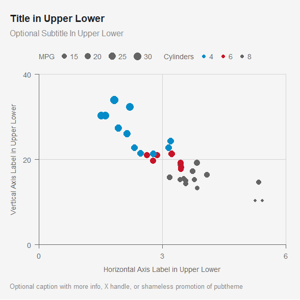

You must have a subfolder called `img` in order for the `ggsave` chunk
above to work.

Note that the default is `base_size=12`, which works well when viewing
the image in RStudio. Use `ggsave` and `base_size=36` when saving an
image instead of exporting from the RStudio viewer. Do not adjust the
`width=20` in ggsave.

Do not change `width=20`, `units='in'`, or `dpi=72`. Height can be
adjusted if desired. A square image is often preferred, so when in
doubt, keep height at 20.

Upper Lower means First letter of each word is capitalized. The option
`expand=FALSE` removes the default padding. The option `breaks=c(0,3,6)`
sets 3 lines at left, middle, and right. You can certainly add lines if
there is a reason to, but when in doubt you can stick with just 3 lines
(left/middle/right) only. Similarly, for the y-axis, top/middle/bottom
only.

You’ll notice a `scale_size(range=c(6,18)` when preparing the plot to be
saved. If you are using `size` inside `aes()`, you’ll need that change
the scale, otherwise the points will be too small.

## `pub` function

We explicitly specified the `scale`s and `coord_cartesian` above. To use
the default settings in `pubtheme`, you can save a lot of typing by
using the function `pub`, which applies `theme_pub` and also
automatically adds `scale`s and `coord` similar to above.

``` r
title = "Title in Upper Lower" 
g = ggplot(dg, aes(x=wt, y=MPG, color=Cylinders))+
  geom_point(aes(size=MPG))+
  labs(title    = title,
       subtitle = 'Optional Subtitle In Upper Lower',
       caption  = "Optional caption giving more info, Twitter handle, or shameless promotion of pubtheme",
       x = 'Horizontal Axis Label in Upper Lower',
       y = 'Vertical Axis Label in Upper Lower')

g %>% 
  pub(xlim = c(0, 6),
      ylim = c(0, 40))

## Save to a file using base_size=36
gg = g %>% 
  pub(xlim = c(0, 6), 
      ylim = c(0, 40), 
      base_size = 36)

ggsave(filename=paste0("img/", gsub("%", " Perc", title), ".jpg"), 
       plot   = gg,
       width  = 20,   
       height = 20,  
       units  = 'in', 
       dpi    = 72)  
```

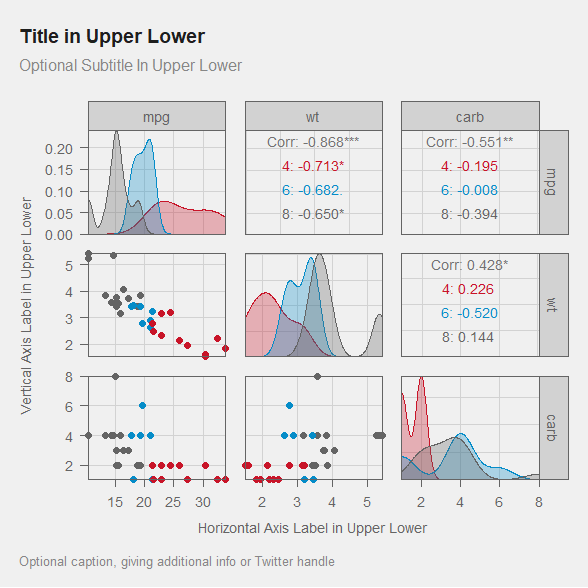
To save to a file, we again need `base_size = 36`. We simply copy and
paste the `pub` code and add `base_size = 36`.

## Pairs plot

``` r
library(GGally) ## Needed for ggpairs function
dg = mtcars %>%
  select(mpg, cyl, wt, carb) %>%
  mutate(cyl=factor(cyl))

title = 'Title in Upper Lower'
g = ggpairs(dg, 
            columns = c('mpg', 'wt', 'carb'),
            aes(color = cyl, 
                fill  = cyl), 
            diag = list(continuous = pub.density)) +
  labs(title    = title,
       subtitle = 'Optional Subtitle In Upper Lower',
       caption  = "Optional caption giving more info, Twitter handle, or shameless promotion of pubtheme",
       x = 'Horizontal Axis Label in Upper Lower',
       y = 'Vertical Axis Label in Upper Lower')+
  theme_pub(type='pairs')
print(g)

## Save to a file using base_size=36
gg = g +
  theme_pub(type='pairs', 
            base_size=36)

ggsave(filename=paste0("img/", gsub("%", " Perc", title), ".jpg"), 
      plot=gg,
      width=20,   
      height=20,  
      units='in', 
      dpi=72)  
```


Note that since the object `g` resulting from using `ggpairs` is not a
`ggplot` object, `pub` can’t be used with it.

## Line plot

Since `name` and `value` will be more common column names when using
these in the wild, we’ll rename some columns to be name and value, to
simplify copying and pasting later.

Continuous variables for `x` seem to be more common, so we’ll convert
date to days for this example, so that copying and pasting later becomes
easier. We’ll use `toupper()` to avoid using variables with all
lowercase letters in the legend.

``` r
dg = economics_long %>%
  mutate(name = toupper(variable), 
         days = as.numeric(date - min(date)), 
         value= value01) %>%
  select(date, days, name, value)
head(dg)
#> # A tibble: 6 × 4
#>   date        days name     value
#>   <date>     <dbl> <chr>    <dbl>
#> 1 1967-07-01     0 PCE   0       
#> 2 1967-08-01    31 PCE   0.000265
#> 3 1967-09-01    62 PCE   0.000762
#> 4 1967-10-01    92 PCE   0.000471
#> 5 1967-11-01   123 PCE   0.000916
#> 6 1967-12-01   153 PCE   0.00157

title = "Title in Upper Lower" 
g = ggplot(dg, aes(x=days, y=value, color=name))+
  geom_line()+
  labs(title    = title,
       subtitle = 'Optional Subtitle In Upper Lower',
       caption  = "Optional caption giving more info, Twitter handle, or shameless promotion of pubtheme",
       x = 'Horizontal Axis Label in Upper Lower', 
       y = 'Vertical Axis Label in Upper Lower')

g %>% 
  pub(type='line', 
      ylim=c(0,1))

## Save to a file using base_size=36
gg = g %>% 
  pub(type='line', 
      ylim=c(0,1), 
      base_size=36)

ggsave(filename=paste0("img/", gsub("%", " Perc", title), ".jpg"), ## must have a subfolder called 'img'
       plot=gg,
       width=20,   
       height=20,  
       units='in', 
       dpi=72)     
```


Note that once again we set breaks for the y-axis at the top, middle,
and bottom.

### Line plot with date

You can use the same code as Line Plot above (except use `x=date`), and
`pub` will detect the date scale and format appropriately. You can
change the format of the labels as shown below with `xlabels`.

``` r
title = "Title in Upper Lower" 
g = ggplot(dg, aes(x=date, y=value, color=name))+
  geom_line()+
  labs(title    = title,
       subtitle = 'Optional Subtitle In Upper Lower',
       caption  = "Optional caption giving more info, Twitter handle, or shameless promotion of pubtheme",
       x = 'Horizontal Axis Label in Upper Lower', 
       y = 'Vertical Axis Label in Upper Lower')

g %>% 
  pub(type = 'line', 
      ylim = c(0,1), 
      xbreaks = as.Date(c('1970-01-01', '1990-01-01', '2010-01-01')), ## optional
      xlabels = function(x) format(x, '%b%e, %Y')) ## optional
```

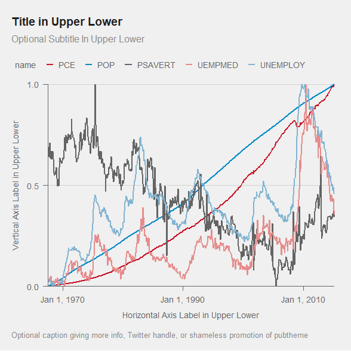

## Histogram

``` r
dg = economics %>%
  filter(date<='2008-01-01') %>%
  rename(value=unemploy)

title = "Title in Upper Lower" 
g  = ggplot(dg, aes(x=value))+
  geom_histogram(fill=pubred, color=pubbackgray, binwidth=500) + ## set a reasonable binwidth
  labs(title    = title,
       subtitle = 'Optional Subtitle In Upper Lower',
       caption  = "Optional caption giving more info, Twitter handle, or shameless promotion of pubtheme",
       x = 'Horizontal Axis Label in Upper Lower', ## Required.
        y = 'Count') 

g %>% 
  pub(type='hist')

## Save to a file using base_size=36
gg = g %>% 
  pub(type='hist', 
      base_size=36)

ggsave(filename=paste0("img/", gsub("%", " Perc", title), ".jpg"), 
       plot = gg,
       width=20,   ## do not change
       height=20,  
       units='in', ## do not change
       dpi=72)     ## do not change
```

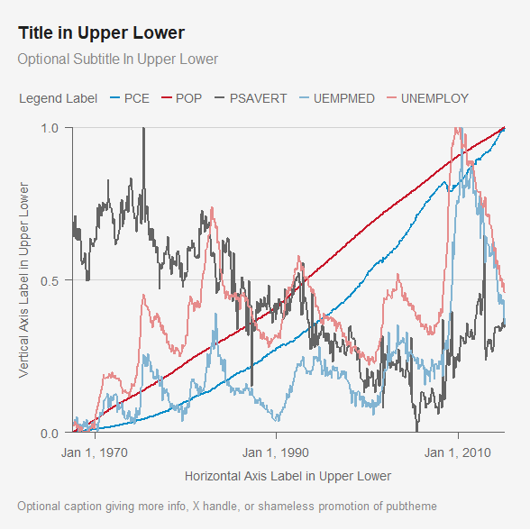

Here `binwidth` will almost surely need to be changed for your data.

## Bar plot

We’ll use the `mtcars` data again, with some modifications. For
cylinder, we’ll add `-cylinder` to the numbers so it looks nice. We’ll
then convert it a factor so that we can specify the order. We’ll also
create a column called `max` which controls the length of the lightgray
bars in the background. Finally, we’ll rename `cyl` and `mpg` to `name`
and `value`, which will be convenient when copying and pasting this
code.

``` r
dg = mtcars %>%
  group_by(cyl) %>%
  summarise(mpg = mean(mpg)) %>%
  mutate(cyl = paste0(cyl, '-cylinder'),
         cyl = factor(cyl, levels=c('8-cylinder', '6-cylinder', '4-cylinder'))) %>% ## for background cars
  rename(name  = cyl, 
         value = mpg) 

title = "Title in Upper Lower" 
g = ggplot(dg, aes(x=value, y=name))+
  geom_col(width=0.8, aes(x=30), fill=publightgray)+ ## optional background bars. 
  geom_col(width=0.8)+ 
  geom_text(aes(label=round(value,2)), hjust=-0.1)+ ## optional numbers with reasonable number of digits
  labs(title    = title,
       subtitle = 'Optional Subtitle In Upper Lower',
       caption  = "Optional caption giving more info, Twitter handle, or shameless promotion of pubtheme",
       x = 'Horizontal Axis Label in Upper Lower', ## Optional. 
       y = NULL)  ## Optional. Upper Lower.

g %>% 
  pub(type='bar')

## Save to a file using base_size=36
gg = g %>% 
  pub(type='bar', 
      base_size=36)

ggsave(filename=paste0("img/", gsub("%", " Perc", title), ".jpg"), ## must have a subfolder called 'img'
       plot = gg,
       width=20,   ## do not change
       height=15,  
       units='in', ## do not change
       dpi=72)     ## do not change
```

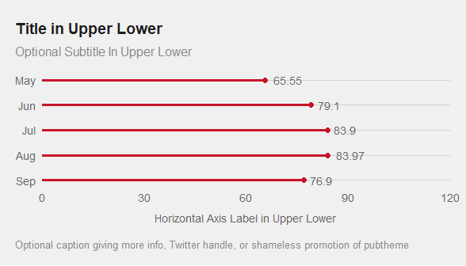

If you are using digits next to the bars, you can increase the `max` so
the text fits.

You may want to remove `x` and `y` axis titles. If not used, use
`x=NULL` and/or `y=NULL` above. Do not use `x=''` and/or `y=''`. If you
do use axes titles, they should be in Upper Lower.

## Grid plot

``` r
dg = airquality %>%
  mutate(Month= month.abb[Month],
         Month = factor(Month, levels=rev(month.abb[month.abb %in% Month])), 
         Day   = factor(Day, levels=1:31)) %>% 
  rename(x  = Day,
         y = Month,
         value = Temp)
#head(dg)

title = "Title in Upper Lower"
g = ggplot(dg %>%
             complete(x, y, fill=list(value=NA)), ## so that all combos have a tile
           aes(x=x, y=y, fill=value))+
  geom_tile(linewidth=0.4, show.legend = T, color=pubdarkgray) +
  scale_fill_gradient(low = pubbackgray,
                      high = pubred,
                      na.value = 'white',
                      oob=squish, 
                      breaks=c(60,75,90), 
                      guide=guide_colorbar(frame.colour = pubdarkgray)) +
  labs(title    = title,
       subtitle = 'Optional Subtitle In Upper Lower',
       caption  = "Optional caption giving more info, Twitter handle, or shameless promotion of pubtheme",
       x = 'Day (Optional Axis Label in Upper Lower)', 
       y = NULL, ## Optional
       fill = 'Value') 

g %>% 
  pub(type = 'grid',
      xbreaks = seq(2, 32, by=2))

## Save to a file using base_size=36
gg = g %>%
  pub(type = 'grid', 
      xbreaks = seq(2, 32, by=2),
      base_size=36)

ggsave(filename=paste0("img/", gsub("%", " Perc", title), ".jpg"), 
       plot=gg,
       width=20,   ## do not change
       height=12,  
       units='in', ## do not change
       dpi=72)     ## do not change
```

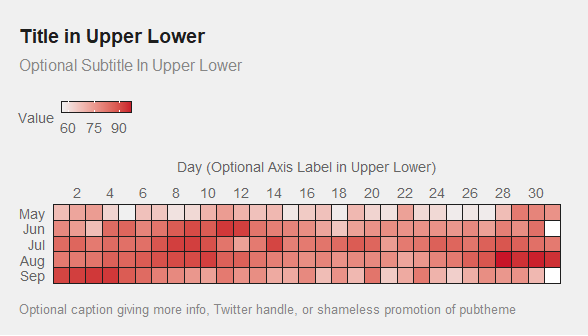

## Lollipop plot

We’ll make a horizontal lollipop plot. It can be used an alternative to
a bar plot, and it is often preferred, especially when the visualization
will eventually be printed since the lollipop plot used far less
ink/toner.

``` r
dg = airquality %>%
  mutate(Month= month.abb[Month],
         Month = factor(Month, levels=rev(month.abb))) %>% 
  group_by(Month) %>%
  summarise(Temp=mean(Temp)) %>%
  rename(name  = Month,
         value = Temp)


title = "Title in Upper Lower" 
g = ggplot(dg, aes(x=value, y=name))+
  geom_point(color=pubred)+ 
  geom_segment(aes(x=0, xend=value, y=name, yend=name), color=pubred)+
  geom_text(aes(label=round(value,2)), hjust=-0.3)+ ## optional numbers with reasonable number of digits
  labs(title    = title,
       subtitle = 'Optional Subtitle In Upper Lower',
       caption  = "Optional caption giving more info, Twitter handle, or shameless promotion of pubtheme",
       x = 'Horizontal Axis Label in Upper Lower', ## Optional. 
       y = NULL)  ## Optional. Upper Lower.

g %>% 
  pub(type='pop', 
      xlim=c(0,120))

## Save to a file using base_size=36
gg = g %>% 
  pub(type='pop',
      xlim=c(0,120),
      base_size=36)

ggsave(filename=paste0("img/", gsub("%", " Perc", title), ".jpg"), ## must have a subfolder called 'img'
       plot = gg,
       width=20,   ## do not change
       height=15,  
       units='in', ## do not change
       dpi=72) 
```

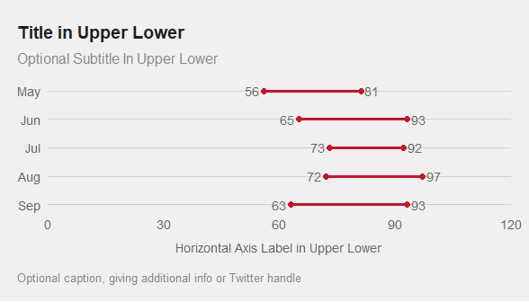

## Lollipop for discrete distributions

This still uses `type='pop'` but we’ll use a different template for
copying/pasting.

``` r
dg = data.frame(name=0:10, 
                value=dbinom(0:10, 10, .5))

title = "Title in Upper Lower" 
g = ggplot(dg, aes(x=name, y=value))+
  geom_point(color=pubred)+ 
  geom_segment(aes(x=name, xend=name, y=0, yend=value), color=pubred)+
  geom_text(aes(label=round(value,2)), vjust=-0.5)+ ## optional numbers with reasonable number of digits
  labs(title    = title,
       subtitle = 'Optional Subtitle In Upper Lower',
       caption  = "Optional caption giving more info, Twitter handle, or shameless promotion of pubtheme",
       x = 'Horizontal Axis Label in Upper Lower', ## Optional. 
       y = NULL)  ## Optional. Upper Lower.
  
g %>% 
  pub(type='pop', 
      xlim=c(0, 10), 
      ylim=c(0, .3), 
      xbreaks=0:10,
      ybreaks=c(0,.1, .2, .3))

## Save to a file using base_size=36
gg = g %>% 
  pub(type='pop', 
      xlim=c(0, 10), 
      ylim=c(0, .3), 
      xbreaks=0:10, 
      ybreaks=c(0,.1, .2, .3), 
      base_size=36)

ggsave(filename=paste0("img/", gsub("%", " Perc", title), ".jpg"), ## must have a subfolder called 'img'
       plot = gg,
       width=20,   ## do not change
       height=15,  
       units='in', ## do not change
       dpi=72) 
```

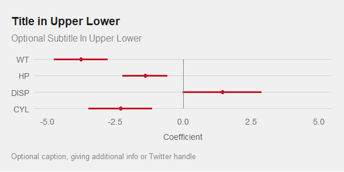

## Barbell plot

This still uses `type='pop'` but we’ll use a different template for
copying/pasting.

``` r
dg = airquality %>%
  mutate(Month= month.abb[Month],
         Month = factor(Month, levels=rev(month.abb))) %>% 
  group_by(Month) %>%
  summarise(x   =min(Temp), 
            xend=max(Temp)) %>%
  rename(name  = Month)


title = "Title in Upper Lower" 
g = ggplot(dg, aes(y=name))+
  geom_point(aes(x=x   ), color=pubred)+ 
  geom_point(aes(x=xend), color=pubred)+ 
  geom_segment(aes(x=x, xend=xend, yend=name), color=pubred)+
  geom_text(aes(x=x,    label=round(x   ,2)), hjust=1.3)+ ## optional numbers with reasonable number of digits
  geom_text(aes(x=xend, label=round(xend,2)), hjust=-0.3)+ ## optional numbers with reasonable number of digits
  labs(title    = title,
       subtitle = 'Optional Subtitle In Upper Lower',
       caption  = "Optional caption giving more info, Twitter handle, or shameless promotion of pubtheme",
       x = 'Horizontal Axis Label in Upper Lower', ## Optional. 
       y = NULL)  ## Optional. Upper Lower.

g %>% 
  pub(type='pop', 
      xlim=c(0,120))

## Save to a file using base_size=36
gg = g %>% 
  pub(type='pop', 
      xlim=c(0,120), 
      base_size=36)

ggsave(filename=paste0("img/", gsub("%", " Perc", title), ".jpg"), ## must have a subfolder called 'img'
       plot = gg,
       width=20,   ## do not change
       height=15,  
       units='in', ## do not change
       dpi=72) 
```

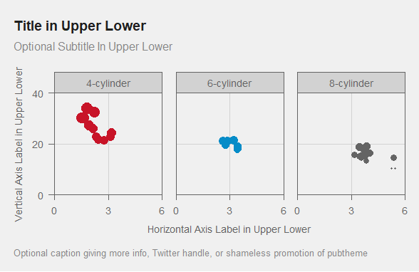

## Dot and Whiskers Plot

It is often desirable to visualize regression coefficients using a dot
and whiskers plot instead of showing a table of coefficients and
standard errors. We’ll make up a regression model and demonstrate that
here.

This still uses `type='pop'` but we’ll use a different template for
copying/pasting.

``` r
## standardize predictors so they are roughly the same scale
d = mtcars %>%
  mutate(wt = scale(wt),  
         cyl=scale(cyl), 
         disp=scale(disp), 
         hp = scale(hp))

m1 = lm(mpg ~  wt + cyl + disp + hp, data=d)
#summary(m1)

dg = summary(m1)$coefficients %>% 
  as.data.frame() %>%
  rownames_to_column(var = 'var') %>%
  rename(coef=Estimate, se=`Std. Error`) %>%
  select(var, coef, se) %>%
  mutate(var = toupper(gsub('[(]|[)]', '', var))) %>%
  filter(var!='INTERCEPT')

title = "Title in Upper Lower" 
g = ggplot(dg, aes(x=coef, y=var))+
  geom_segment(aes(x    = coef-se, 
                   xend = coef+se,
                   y    = var, 
                   yend = var), color=pubred)+
  geom_point(color=pubred) +
  geom_vline(xintercept=0, color=pubmediumgray)+
  labs(title    = title,
       subtitle = 'Optional Subtitle In Upper Lower',
       caption  = "Optional caption giving more info, Twitter handle, or shameless promotion of pubtheme",
       x = 'Coefficient', 
       y = NULL)  ## Optional. 
 
g %>% 
  pub(type = 'pop', 
      xlim = c(-5, 5))

## Save to a file using base_size=36
gg = g %>% 
  pub(type = 'pop', 
      xlim = c(-5, 5),
      base_size = 36)

ggsave(filename=paste0("img/", gsub("%", " Perc", title), ".jpg"), 
       plot=gg,
       width=20,   ## do not change
       height=10,  
       units='in', ## do not change
       dpi=72)     ## do not change
```

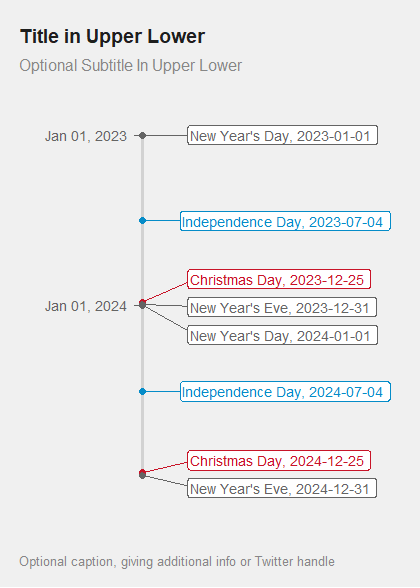

## Faceting

We’ll use our scatter plot example, but with `facet_wrap` to make
separate plots for each `cyl`, and we add a `facet=T` argument to make
some formatting more appropriate for faceted plots.

``` r
dg = mtcars %>%
  select(wt, mpg, cyl) %>%
  mutate(cyl = paste0(cyl, '-cylinder')) %>%
  rename(name = cyl)

title = "Title in Upper Lower" ## to be used by ggplot and ggsave
g = ggplot(dg, aes(x=wt, y=mpg))+
  geom_point(aes(size=mpg, color=name), show.legend=F)+
  facet_wrap(~name, nrow=1) +
  labs(title    = title,
       subtitle = 'Optional Subtitle In Upper Lower',
       caption  = "Optional caption giving more info, Twitter handle, or shameless promotion of pubtheme",
       x = 'Horizontal Axis Label in Upper Lower',
       y = 'Vertical Axis Label in Upper Lower')

g %>% pub(xlim=c(0,6), 
          ylim=c(0,40), 
          facet=T)

## Save to a file using base_size=36
gg = g %>%
  pub(xlim=c(0,6), 
      ylim=c(0,40), 
      facet=T, 
      base_size=36)

ggsave(filename=paste0("img/", gsub("%", " Perc", title), ".jpg"), ## must have a subfolder called 'img'
       width=20,   ## do not change
       height=13,  ## can change if desired. Here, 14 was chosen so that each subplot is square
       units='in', ## do not change
       dpi=72)     ## do not change
```

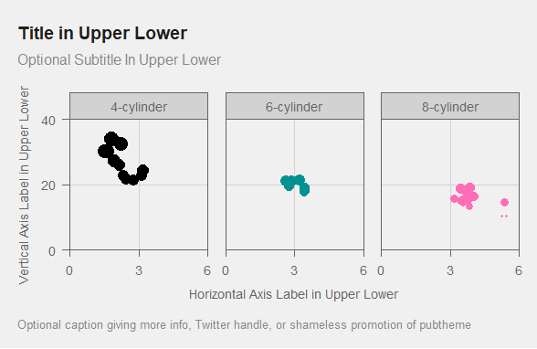

## Timeline

Let’s make up some data. Let’s also define a new “`reverse_trans`”
function called `reverse2_trans`.

``` r
current.year = as.numeric(format(Sys.Date(), "%Y"))
dg = data.frame(date=as.Date(c(paste0(current.year, 
                                   c('-01-01', 
                                     '-07-04', 
                                     '-12-25', 
                                     '-12-31')),
                             paste0(current.year+1, 
                                    c('-01-01', 
                                      '-07-04', 
                                      '-12-25', 
                                      '-12-31')))), 
                text=c("New Year's Day", 
                       "Independence Day",
                       "Christmas Day",
                       "New Year's Eve", 
                       "New Year's Day", 
                       "Independence Day",
                       "Christmas Day",
                       "New Year's Eve")) %>%
  mutate(text = paste0(text, ', ', date), 
         name = case_when(grepl('Christmas', text) ~ 'Christmas', 
                          grepl('Indep'    , text) ~ 'Indep', 
                          TRUE ~ 'Other'), 
         name = factor(name, levels=c('Christmas', 'Indep', 'Other')))
dg
#>         date                         text      name
#> 1 2023-01-01   New Year's Day, 2023-01-01     Other
#> 2 2023-07-04 Independence Day, 2023-07-04     Indep
#> 3 2023-12-25    Christmas Day, 2023-12-25 Christmas
#> 4 2023-12-31   New Year's Eve, 2023-12-31     Other
#> 5 2024-01-01   New Year's Day, 2024-01-01     Other
#> 6 2024-07-04 Independence Day, 2024-07-04     Indep
#> 7 2024-12-25    Christmas Day, 2024-12-25 Christmas
#> 8 2024-12-31   New Year's Eve, 2024-12-31     Other

## Now make the timeline using ggrepel for the text
library(ggrepel) ## for  geom_text_repel() or geom_label_repel()

## Function for reverse date axes 
## Copied from https://github.com/tidyverse/ggplot2/issues/4014
## Will be used by pub. If you are using theme_pub instead of pub, 
## you will need this function and scale_y_continuous(trans='reverse2'). 
reverse2_trans <- function() {
  trans_new(
    "reverse2",
    function(x) -1 * as.numeric(x), # Force values to be numeric for Date objects
    function(x) -1 * as.numeric(x)
  )
}

## Define breaks, title, and plot
breaks = as.Date(paste0(current.year + 0:2, '-01-01'))
title = "Title in Upper Lower" ## to be used by ggplot and ggsave
g = ggplot(dg, aes(x=0, y=date, color=name))+
  geom_segment(aes(x=0, xend=0, y=min(date), yend=max(date)), 
               show.legend = F, 
               color=publightgray)+
  geom_point(show.legend=F)+
  geom_label_repel(aes(label=text),
                   nudge_x = 1,
                   hjust = 0, 
                   direction = 'y',
                   show.legend = F)+
  labs(title    = title,
       subtitle = 'Optional Subtitle In Upper Lower',
       caption  = "Optional caption, Twitter handle, or shameless promotion of pubtheme",
       x = '',
       y = '') 

g %>% 
  pub(type = 'timeline', 
      xlim = c(0,5), 
      ybreaks = breaks,
      ylabels = function(x) format(x, '%b %d, %Y'), 
      ytrans = 'reverse2')

## Save to a file using base_size=36
gg = g %>%
  pub(type = 'timeline', 
      xlim = c(0,5), 
      ybreaks = breaks,
      ylabels = function(x) format(x, '%b %d, %Y'), 
      ytrans = 'reverse2',
      base_size=36)

ggsave(filename=paste0("img/", gsub("%", " Perc", title), ".jpg"), ## must have a subfolder called 'img'
       plot=gg,    ## ggplot using base_size=36
       width=20,   ## do not change
       height=30,  ## can change if desired. Here, 14 was chosen so that each subplot is square
       units='in', ## do not change
       dpi=72)     ## do not change
```

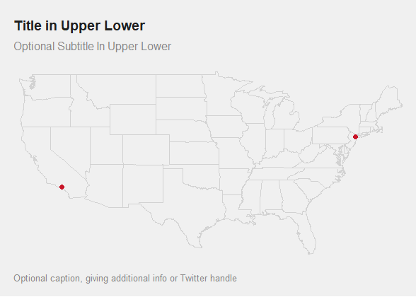

## Default colors

This theme changes your default ggplot colors to those found in
`colors.r`. The palette for discrete color scales
`scale_colour_discrete` and `scale_fill_discrete` consists of red, blue,
gray, light red, and light blue, as seen in the Line Plot above. Recall
that if you want to undo the changes made by this theme, you can use
`restore.ggplot.defaults()` at any time.

If more than 5-6 colors are needed, a 14-color colorblind friendly
palette `cb.pal` can be used by adding
`+ scale_color_manual(values=cb.pal)` or
`+ scale_fill_manual( values=cb.pal)` to a plot. For example,

``` r
dg = mtcars %>%
  mutate(gear = paste0(gear, ' gear'), 
         cyl  = paste0(cyl, ' cyl'  ), 
         name = paste0(gear, ', ', cyl)) 

title = "Title in Upper Lower" ## to be used by ggplot and ggsave
g = ggplot(dg, aes(x=wt, y=mpg))+
  geom_point(aes(color=name))+
  facet_grid(cyl~gear) +
  labs(title    = title,
       subtitle = 'Optional Subtitle In Upper Lower',
       caption  = "Optional caption giving more info, Twitter handle, or shameless promotion of pubtheme",
       x = 'Horizontal Axis Label in Upper Lower',
       y = 'Vertical Axis Label in Upper Lower', 
       color = 'Gears and Cylinders')+
  scale_color_manual(values=cb.pal) +
  guides(color = guide_legend(nrow=3))

g %>% pub(xlim=c(0,6), 
          ylim=c(0,40), 
          facet=T)
```

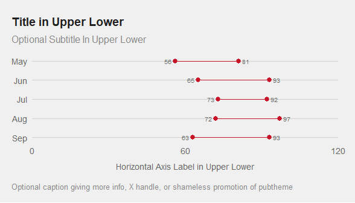

## Maps

``` r
dg = data.frame(city = c('New York', 'Los Angeles'), 
                lat = c( 40.7128,   34.0522),
                lon = c(-74.0060, -118.2437))

title = "Title in Upper Lower"
g = ggplot(dg, aes(x=lon, y=lat))+
  borders('state', colour=publightgray)+
  geom_point(color=pubred)+
  labs(title    = title, 
       subtitle = 'Optional Subtitle In Upper Lower',
       caption  = "Optional caption giving more info, Twitter handle, or shameless promotion of pubtheme")+
  coord_cartesian(expand=F, clip='off')#+
  #theme_pub(type='map')
g %>% pub(type='map')
```

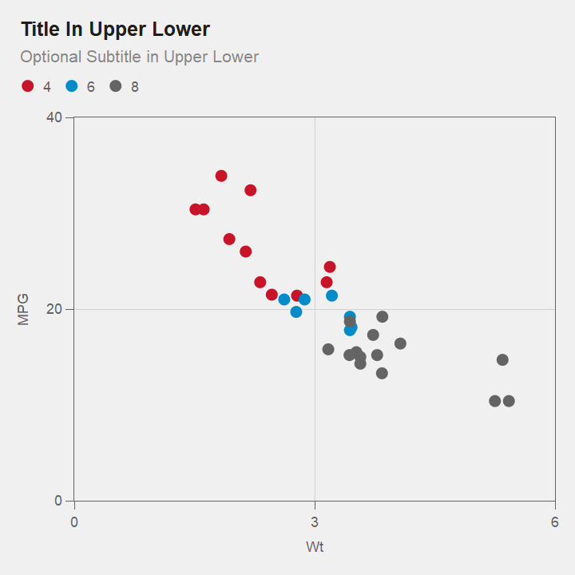

## Hex bins

The function `geom_hex` can be used for making a heat map with hexagonal
bins. Those can be colored by count.

``` r
dg = economics

title = 'Title in Upper Lower'
g = ggplot(dg, 
           aes(x = psavert, 
               y = uempmed)) +
    geom_hex(color=pubbackgray, 
             bins=20) +
  labs(title    = title, 
       subtitle = 'Optional Subtitle In Upper Lower',
       caption  = "Optional caption giving more info, Twitter handle, or shameless promotion of pubtheme", 
       x = 'Personal Savings Rate', 
       y = 'Median Duration of Unemployment', 
       fill = 'Observations')

g %>% pub(xlim = c(0,20), 
          ylim = c(0,30)) +
  scale_size(range=c(1,5)) ## adjust the max, and maybe the min, manually 

## Save to a file using base_size=36
gg = g %>%
  pub(xlim = c(0,20), 
      ylim = c(0,30),
      base_size = 36) + 
  scale_size(range=c(1,5)*3) ## same as above, but times 3

ggsave(filename=paste0("img/", gsub("%", " Perc", title), ".jpg"), ## must have a subfolder called 'img'
       plot=gg,    ## ggplot using base_size=36
       width=20,   ## do not change
       height=20,  ## can change if desired. Here, 14 was chosen so that each subplot is square
       units='in', ## do not change
       dpi=72)     ## do not change
```

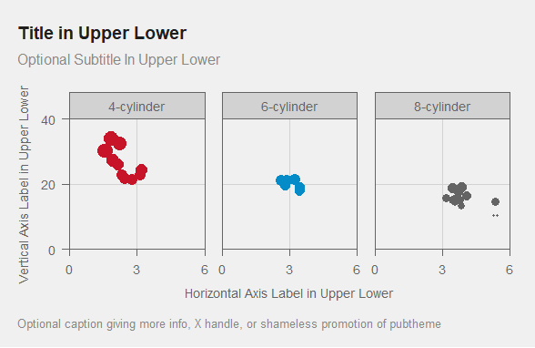

If you want to size the hexagons by count, and color by another
variable, the only way I know is to use `geom_star` with
`starshape = 'hexagon'`. The following code creates some data with
`cell` ID, cell location `x` and `y`, the `count` to be used for size,
and a column `mean.pop` to be used for fill. This is a reasonable
solution but it is not ideal and is still under development.

``` r
library(hexbin)
library(ggstar)

df = economics

h <- hexbin::hexbin(df$psavert,
                    df$uempmed,
                    xbins = 20, 
                    IDs = TRUE)

hh =  data.frame(hexbin::hcell2xy(h),
                 cell  = h@cell,
                 count = h@count, 
                 xcm   = h@xcm, 
                 ycm   = h@ycm)
head(hh)
#>         x        y cell count      xcm  ycm
#> 1  9.7500 4.000000   11     2  9.90000 4.10
#> 2 10.5050 4.000000   12     4 10.40000 4.25
#> 3 11.2600 4.000000   13     3 11.23333 4.40
#> 4 12.0150 4.000000   14     3 11.83333 4.30
#> 5 13.5250 4.000000   16     1 13.30000 4.10
#> 6  4.8425 4.917987   25     1  4.50000 5.20

df$cell = h@cID

dg <- df %>%
  group_by(cell) %>%
  summarise(n = n(),           ## for size
            pop=sum(pop)) %>%  ## for fill
  ungroup() %>%
  mutate(mean.pop = pop/n) %>%
  right_join(hh, by = "cell") %>%
  select(cell, x, y, count, n, pop, mean.pop)

title = 'Title in Upper Lower'
g = ggplot(dg, 
           aes(x = x, 
               y = y, 
               fill = mean.pop, 
               size = n)) +
  geom_star(colour = pubbackgray,
            starshape = 'hexagon',
            show.legend = T) +
  labs(title    = title, 
       
       subtitle = 'Optional Subtitle In Upper Lower',
       caption  = "Optional caption giving more info, Twitter handle, or shameless promotion of pubtheme", 
       x = 'Personal Savings Rate', 
       y = 'Median Duration of Unemployment', 
       size = 'Observations', 
       fill = 'Mean Population')+
  scale_fill_gradient(guide='legend', low = publightgray, high=pubblue) +
  guides(size = guide_legend(nrow = 3, override.aes = list(fill=pubdarkgray)), 
         fill = guide_legend(nrow = 2, override.aes = list(size=5)))

g %>% pub(xlim = c(0,20), 
          ylim = c(0,30)) +
  scale_size(range=c(1,5)) ## adjust the max, and maybe the min, manually 

## Save to a file using base_size=36
gg = g %>%
  pub(xlim = c(0,20), 
      ylim = c(0,30),
      base_size = 36) + 
  scale_size(range=c(1,5)*3) ## same as above, but times 3

ggsave(filename=paste0("img/", gsub("%", " Perc", title), ".jpg"), ## must have a subfolder called 'img'
       plot=gg,    ## ggplot using base_size=36
       width=20,   ## do not change
       height=20,  ## can change if desired. Here, 14 was chosen so that each subplot is square
       units='in', ## do not change
       dpi=72)     ## do not change
```

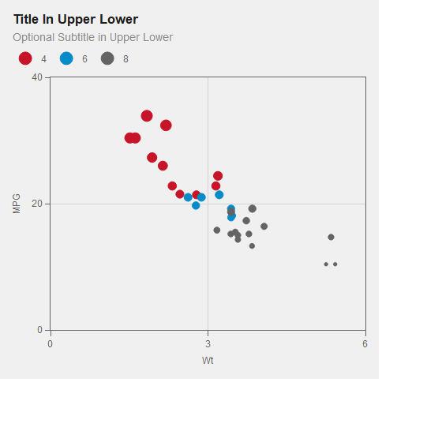

## plotly

You can use `layout_pub` to get similar formatting for `plotly` figures
that use `ggplotly` or `plot_ly`. This is under development. Only using
`type='scatter'` with `plot_ly` is currently supported. Others may work
and will be added “soon”, according to some defintion of soon.

Here is an example using `plot_ly`:

``` r
library(htmlwidgets)
dg = mtcars %>% 
  select(wt, mpg, cyl) %>%
  mutate(cyl = factor(cyl)) %>%
  rownames_to_column('name')

base_size=12
p=plot_ly(data=dg, 
          width=1440*base_size/36, 
          height=1440*base_size/36) %>%
  add_trace(type   = 'scatter', 
            mode   = 'markers',
            x      = ~wt, 
            y      = ~mpg, 
            color  = ~cyl, 
            size   = ~mpg,
            text   = ~name,
            colors = default.pal[1:3], ## change 3 to number of categories
            marker = list(opacity=1),# add size=30*base_size/36 if no size above
            hovertemplate = paste0( 
              "<b>%{text}</b><br>",
              "%{yaxis.title.text}: %{y:,.3f}<br>",
              "%{xaxis.title.text}: %{x:,.2f}<br>",
              "<extra></extra>")) %>%
  layoutpub(type      = 'scatter', 
            base_size = base_size, 
            subtitle  = T, 
            caption   = F, 
            legend.rows = 1) %>%
  layout(
    title = list(text = maketitle(title     = 'Title In Upper Lower',
                                  subtitle  = 'Optional Subtitle in Upper Lower',
                                  base_size = base_size)), 
    xaxis = list(title    = list(text = 'Wt'),
                 range    = c(0,    6),
                 tickvals = c(0, 3, 6)),
    yaxis = list(title    = list(text = 'MPG'), 
                 range    = c(0,     40), 
                 tickvals = c(0, 20, 40))) 
#print(p)

htmlwidgets::saveWidget(widget = p,
                        file = paste0("img/", gsub("%", " Perc", title), ".html"),
                        selfcontained = F,
                        libdir = "lib")
```

Click
[here](https://bmacgtpm.github.io/pubtheme/img/Title%20in%20Upper%20Lower.html)
or click on the image below to view the interactive version of the plot.

``` r
knitr::include_url("https://bmacgtpm.github.io/pubtheme/img/Title%20in%20Upper%20Lower.html")
```

<a href="https://bmacgtpm.github.io/pubtheme/img/Title%20in%20Upper%20Lower.html" target="_blank">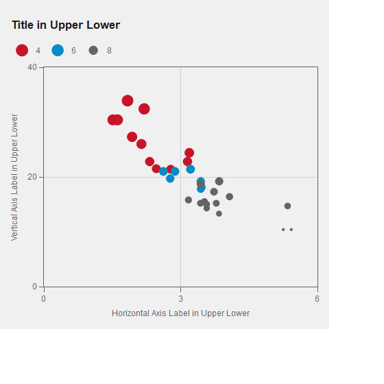</a>

Note that the caption at the bottom of the plot is currently not
functioning properly.

## ggplotly

Here is an example using `ggplotly`.

``` r
dg = mtcars %>% 
  select(wt, mpg, cyl) %>%
  mutate(Cylinders = as.factor(cyl)) %>%
  rename(MPG = mpg, 
         Weight=wt) %>%
  rownames_to_column('name')

g = ggplot(dg, aes(x=Weight, y=MPG, color=Cylinders, text=name))+
  geom_point(aes(size=MPG))+
  labs(title    = title,
       subtitle = 'Optional Subtitle In Upper Lower',
       caption  = "Optional caption giving more info, Twitter handle, or shameless promotion of pubtheme",
       x = 'Horizontal Axis Label in Upper Lower',
       y = 'Vertical Axis Label in Upper Lower', 
       size = "MPG")

## Convert g to plotly using ggplotly
base_size=12
p = g %>% 
  pub(xlim = c(0, 6),
      ylim = c(0, 40)) %>%
  ggplotly(width   = 1440*base_size/36, 
           height  = 1440*base_size/36, 
           tooltip = c('x', 'y', 'color', 'text')) %>%
  layoutpub(type      = 'scatter', 
            base_size = base_size, 
            subtitle  = T, 
            caption   = F, 
            legend    = T) %>%
  style(marker.sizeref=1.5)
p
```

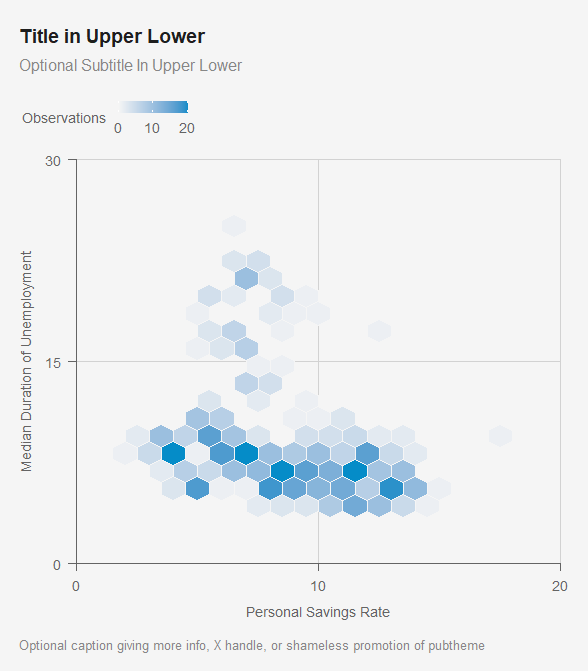

``` r

htmlwidgets::saveWidget(widget = p,
                        file = paste0("img/", gsub("%", " Perc", title), ".html"),
                        selfcontained = F,
                        libdir = "lib")
```

The plot isn’t interactive here. Run the code to see the interactive
plot.

As with non-interactive plots above, you can use `pub` to save a lot of
typing if you are ok with accepting more default settings. If you use
`pub` with `int=TRUE` (`int` for interactive), the `ggplot` object will
be converted to a `plotly` object using the `ggplotly` and `layoutpub`
code above. You’ll just need to specify the arguments `subtitle`,
`caption` and `legend.rows` required by `layoutpub`.

``` r
g %>% 
  pub(xlim = c(0, 6),
      ylim = c(0, 40), 
      int  = T,
      tooltip = c('x', 'y', 'color', 'text'), 
      subtitle  = T, 
      caption   = F, 
      legend.rows = 1)
```

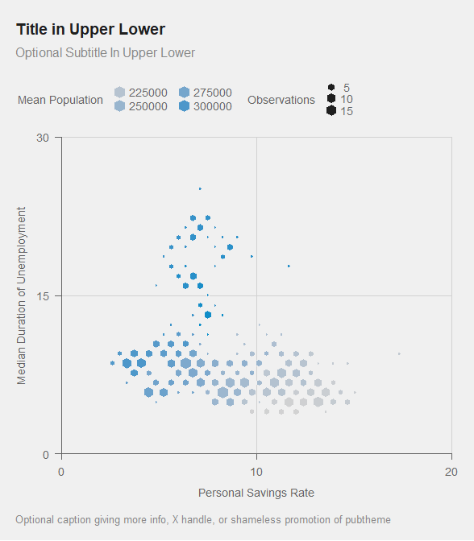
If you want to customize the tooltip (e.g. when you are unable to
specify the order that you want), you can create a `text` column that
has the information you want, in the order that you want. You can also
include HTML code to format the text.

In the example below, the car name is bolded using `<b> </b>`, and
Weight, MPG, and Cylinders appear as additional information. The
function `tooltip.text` helps make it easier. You can list *unquoted*
column names in the order you want them. The entries in the tooltip are
typically of the from “ColumnName: Value”. If there is a `name` column
listed, it automatically makes it bold and removes `name:` from the
tooltip, like this:

**Toyota Corolla** <br> Weight: 1.835 <br> MPG: 33.9 <br> Cylinders: 4

``` r
dg = mtcars %>% 
  select(wt, mpg, cyl) %>%
  mutate(Cylinders = as.factor(cyl)) %>%
  rename(MPG = mpg, 
         Weight=wt) %>%
  rownames_to_column('name') %>%
  mutate(text = tooltip.text(name, Weight, MPG, Cylinders))

  
g = ggplot(dg, aes(x=Weight, y=MPG, color=Cylinders, text=text))+
geom_point(aes(size=MPG))+
labs(title    = title,
     subtitle = 'Optional Subtitle In Upper Lower',
     caption  = "Optional caption giving more info, Twitter handle, or shameless promotion of pubtheme",
     x = 'Horizontal Axis Label in Upper Lower',
     y = 'Vertical Axis Label in Upper Lower', 
     size = "MPG")

g %>% 
  pub(xlim = c(0, 6),
      ylim = c(0, 40), 
      int  = T,
      tooltip = 'text',
      subtitle  = T, 
      caption   = F, 
      legend.rows = 1)
```

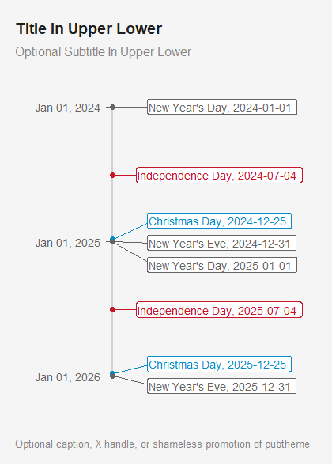
