<!-- README.md is generated from README.Rmd. Please edit that file -->

# pubtheme

<!-- badges: start -->
<!-- badges: end -->

The package `pubtheme` contains a `ggplot` theme `theme_pub` for
creating data journalism-style data visualizations with color palettes
and formatting similar to those used by media organizations like BBC, NY
Times, and ESPN. Several templates for scatter plot, line plots, etc.,
are provided below for easy copying/pasting. A helpful function `pub`
can be used to reduce then amount of code that needs to be typed when
the user is comfortable with the default settings.

Organization-specific color palettes and logos can be used as well via
the package `orgthemes`. See <https://github.com/bmacGTPM/orgthemes>.

## Installation

If you don’t have the package `devtools`, install it using
`install.packages('devtools')`. If you have `devtools`, you can install
the GitHub version of `pubtheme` with:

``` r
devtools::install_github("bmacGTPM/pubtheme")
```

If you get an error about download method, try changing this option
before installing.

``` r
options(download.file.method = 'libcurl')
```

Load the package using

``` r
library(pubtheme)
```

as usual. The theme will change some of your ggplot defaults the first
time you use it. To change them back, restart R, or use

``` r
restore.ggplot.defaults()
```

at any time. It is recommended that you update your version of
`tidyverse` and especially `ggplot2` to use this package.

## Scatter plot

``` r
dg = mtcars %>% 
  select(wt, mpg, cyl) %>%
  mutate(Cylinders = as.factor(cyl)) %>%
  rename(MPG = mpg)

title = "Title in Upper Lower" 
g = ggplot(dg, 
           aes(x     = wt, 
               y     = MPG, 
               color = Cylinders, 
               size  = MPG)) +
  geom_point() +
  labs(title    = title,
       subtitle = 'Optional Subtitle In Upper Lower',
       caption  = "Optional caption with more info, X handle, or shameless promotion of pubtheme",
       x = 'Horizontal Axis Label in Upper Lower',
       y = 'Vertical Axis Label in Upper Lower') +
  scale_x_continuous(limits = c(0, 6), 
                     breaks = c(0, 3, 6), 
                     oob    = squish, 
                     labels = comma) +
  scale_y_continuous(limits = c(0,40), 
                     breaks = c(0,20,40), 
                     oob    = squish, 
                     labels = comma) +
  scale_size(range = c(2, 6)) +
  coord_cartesian(clip   = 'off', 
                  expand = F) +
  theme_pub(type = 'scatter') 
print(g)

## Save to a file using base_size = 36
gg = g +
  scale_size(range = c(6, 18)) +
  theme_pub(type = 'scatter', 
            base_size = 36)

ggsave(filename = paste0("img/", gsub("%", " Perc", title), ".jpg"), 
       plot   = gg,
       width  = 20,   ## do not change
       height = 20,   ## can change from 20 if desired
       units  = 'in', ## do not change
       dpi    = 72)   ## do not change

g.scatter = g ## save for later
```

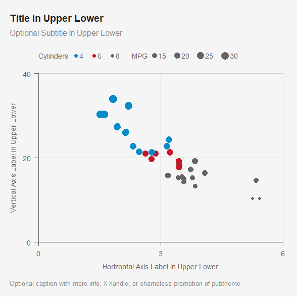

You must have a subfolder called `img` in order for the `ggsave` chunk
above to work.

Note that the default is `base_size = 12`, which works well when viewing
the image in RStudio. Use `ggsave` and `base_size = 36` when saving an
image instead of exporting from the RStudio viewer. Do not adjust the
`width = 20` in ggsave.

Do not change `width = 20`, `units  = 'in'`, or `dpi    = 72`. Height
can be adjusted if desired. A square image is often preferred, so when
in doubt, keep height at 20.

Upper Lower means First letter of each word is capitalized. The option
`expand = FALSE` removes the default padding. The option
`breaks=c(0, 3, 6)` sets 3 lines at left, middle, and right. You can
certainly add lines if there is a reason to, but when in doubt you can
stick with just 3 lines (left/middle/right) only. Similarly, for the
y-axis, top/middle/bottom only.

You’ll notice a `scale_size(range = c(6, 18)` when preparing the plot to
be saved. If you are using `size` inside `aes()`, you’ll need that
change the scale, otherwise the points will be too small.

## `pub` function

We explicitly specified the `scale*` and `coord_cartesian` above. To use
the default settings in `pubtheme`, you can save a lot of typing by
using the function `pub`, which applies `theme_pub` and also
automatically adds `scale*` and `coord*` similar to above. The function
also aligns the legend with the left side of the title and subtitle.

``` r
title = "Title in Upper Lower" 
g = ggplot(dg, 
           aes(x     = wt, 
               y     = MPG, 
               color = Cylinders, 
               size  = MPG)) +
  geom_point() +
  labs(title    = title,
       subtitle = 'Optional Subtitle In Upper Lower',
       caption  = "Optional caption giving more info, X handle, or shameless promotion of pubtheme",
       x = 'Horizontal Axis Label in Upper Lower',
       y = 'Vertical Axis Label in Upper Lower')

g %>% 
  pub(xlim = c(0, 6),
      ylim = c(0, 40))

## Save to a file using base_size = 36
gg = g %>% 
  pub(xlim = c(0, 6), 
      ylim = c(0, 40), 
      base_size = 36)

ggsave(filename = paste0("img/", 
                         gsub("%", " Perc", title), 
                         ".jpg"), 
       plot   = gg,
       width  = 20,   ## do not change
       height = 20,   ## can change from 20 if desired
       units  = 'in', ## do not change
       dpi    = 72)   ## do not change
```

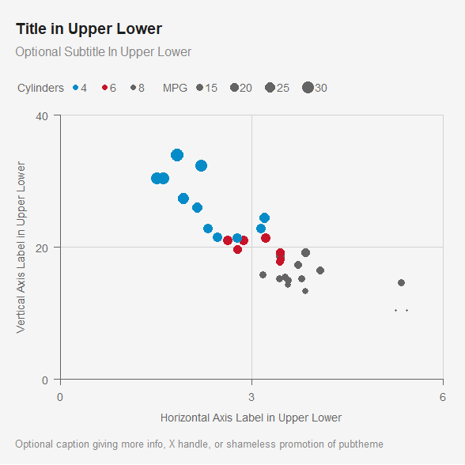

To save to a file, we again need `base_size = 36`. We simply copy and
paste the `pub` code and add `base_size = 36`.

## Correlation plot

Let’s make a correlation plot in the look of `pubtheme`. Since
`corrplot` gives a `corrplot` object, `pub` can’t be used with it, so we
have to make a correlation plot from scratch using `geom_tile`.

``` r
## choose order of variables
cols = sort(unique(colnames(mtcars)))

corr <- round(cor(mtcars[,cols]), 2)
head(corr,2)
#>        am carb   cyl  disp  drat gear    hp   mpg  qsec    vs    wt
#> am   1.00 0.06 -0.52 -0.59  0.71 0.79 -0.24  0.60 -0.23  0.17 -0.69
#> carb 0.06 1.00  0.53  0.39 -0.09 0.27  0.75 -0.55 -0.66 -0.57  0.43
```

``` r

dg = corr %>%
  as.data.frame() %>%
  
  ## longer format
  rownames_to_column(var = 'x') %>%
  pivot_longer(cols      = -x, 
               names_to  = 'y', 
               values_to = 'value') %>%
  
  ## order them however you'd like
  mutate(x = factor(x, levels = rev(sort(unique(x)))), 
         y = factor(y, levels = sort(unique(y))))

title = "Title in Upper Lower"
g = ggplot(dg) + 
  geom_tile(aes(x    = x, 
                y    = y, 
                fill = value),
            linewidth   = 0.4, 
            show.legend = T, 
            color       = pubdarkgray) +
  scale_fill_gradientn(colors = c('red4', 
                                  pubred, 
                                  publightred, 
                                  'white', ## or 'pubbackgray'
                                  publightblue, 
                                  pubblue, 
                                  'navy'),
                       na.value = pubmediumgray, ## same color as below
                       oob      = squish,
                       breaks   = c(-1, 0, 1),
                       limits   = c(-1,    1)) +

  labs(title    = title,
       subtitle = 'Optional Subtitle In Upper Lower',
       caption  = "Optional caption giving more info, X handle, or shameless promotion of pubtheme",
       x    = 'Day (Optional Axis Label in Upper Lower)', 
       y    = NULL, ## Optional
       fill = 'Value') 

g %>% 
  pub(type    = 'grid') + 
  theme(axis.text.x.top = element_text(angle = 90, 
                                   hjust = 0, 
                                   vjust = 0.3))

gg = g %>%
  pub(type      = 'grid', 
      base_size = 36)

ggsave(filename = paste0("img/", gsub("%", " Perc", title), ".jpg"), 
       plot   = gg,
       width  = 20,   ## do not change
       height = 24,   ## can change from 20 if desired. We use 12 here to make the tiles square
       units  = 'in', ## do not change
       dpi    = 72)   ## do not change
```

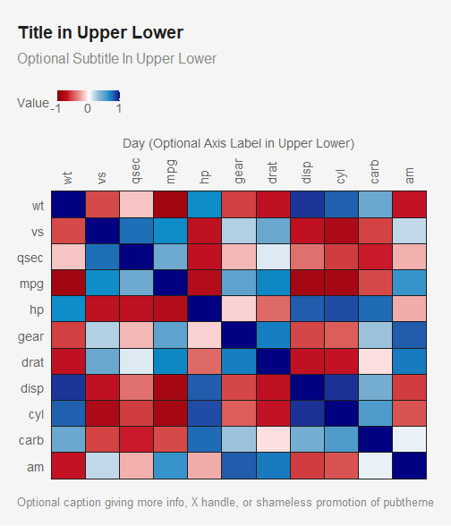

Adding rectangles around clusters, as is often done in `corrplot`.

``` r

# ## note that the function corrRect.hclust is used there
# corrplot::corrplot
# 
# ## note that this converts corr to a distance matrix, and then uses cutree to get the clusters
# corrplot::corrRect.hclust

corr = cor(mtcars)
ds = as.dist(1-corr)
dh = hclust(ds)
hc = cutree(dh, k = 4)

dr = data.frame(order = dh$order,
                cluster = hc) %>%
  mutate(cluster = factor(cluster, 
                          levels = c(1,3,4,2))) %>% ## this order looks better
  arrange(cluster, order) %>%
  mutate(x = 1:n(),
         y = n():1) ## gotta reverse the order


dg = corr %>%
  as.data.frame() %>%
  
  ## longer format
  rownames_to_column(var = 'x') %>%
  pivot_longer(cols      = -x, 
               names_to  = 'y', 
               values_to = 'value') %>%
  
  ## order them the same way as dr
  mutate(x = factor(x, levels =     rownames(dr)),
         y = factor(y, levels = rev(rownames(dr))))

polys = dr %>%
  group_by(cluster) %>%
  summarise(xmin = min(x),
            xmax = max(x),
            ymin = min(y),
            ymax = max(y)) %>%
  mutate(xmin = xmin - 0.5,
         xmax = xmax + 0.5,
         ymin = ymin - 0.5,
         ymax = ymax + 0.5, 
         linewidth = 1.5)

title = "Title in Upper Lower"
g = ggplot(dg) + 
  
  ## Tiles
  geom_tile(aes(x    = x, 
                y    = y, 
                fill = value),
            linewidth   = 0.4, 
            show.legend = T, 
            color       = pubdarkgray) +
  
  ## Rectangles
  geom_rect(data = polys,
            aes(xmin = xmin,
                xmax = xmax,
                ymin = ymin,
                ymax = ymax,
                group = cluster, 
                linewidth = linewidth),
            fill = NA,
            color = 'black', 
            linejoin = 'mitre',    ## mitre or round
            lineend = 'square') +  ## square or round
  
  guides(linewidth = 'none') +
  
  scale_fill_gradientn(colors = c('red4', 
                                  pubred, 
                                  publightred, 
                                  pubbackgray, 
                                  publightblue, 
                                  pubblue, 
                                  'navy'),
                       na.value = pubmediumgray, ## same color as below
                       oob      = squish,
                       breaks   = c(-1, 0, 1),
                       limits   = c(-1,    1)) +

  labs(title    = title,
       subtitle = 'Optional Subtitle In Upper Lower',
       caption  = "Optional caption giving more info, X handle, or shameless promotion of pubtheme",
       x    = 'Day (Optional Axis Label in Upper Lower)', 
       y    = NULL, ## Optional
       fill = 'Value') 
  

g %>% 
  pub(type = 'grid') 


gg = g %>%
  pub(type      = 'grid', 
      base_size = 36)

ggsave(filename = paste0("img/", gsub("%", " Perc", title), ".jpg"), 
       plot   = gg,
       width  = 20,   ## do not change
       height = 24,   ## can change from 20 if desired. We use 12 here to make the tiles square
       units  = 'in', ## do not change
       dpi    = 72)   ## do not change
```

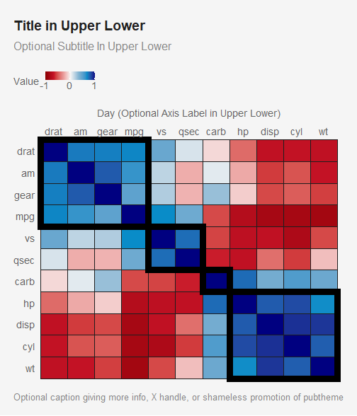

This could be made with `ggcorrplot` as well. I’m not sure if the method
above or below will be more convenient, so I’m leaving both examples
here for now.

``` r
library(ggcorrplot)
corr = cor(mtcars)
ds = as.dist(1-corr)
dh = hclust(ds)
hc = cutree(dh, k = 4)

dr = data.frame(order = dh$order,
                cluster = hc) %>%
  mutate(cluster = factor(cluster, 
                          levels = c(1,3,4,2))) %>% ## this order looks better
  arrange(cluster, order) %>%
  mutate(x = 1:n(),
         y = n():1) ## gotta reverse the order
dr
#>      order cluster  x  y
#> drat     3       1  1 11
#> am       5       1  2 10
#> gear     9       1  3  9
#> mpg     11       1  4  8
#> vs       1       3  5  7
#> qsec     8       3  6  6
#> carb    10       4  7  5
#> hp       2       2  8  4
#> disp     4       2  9  3
#> cyl      6       2 10  2
#> wt       7       2 11  1
```

``` r

polys = dr %>%
  group_by(cluster) %>%
  summarise(xmin = min(x),
            xmax = max(x),
            ymin = min(y),
            ymax = max(y)) %>%
  mutate(xmin = xmin - 0.5,
         xmax = xmax + 0.5,
         ymin = ymin - 0.5,
         ymax = ymax + 0.5, 
         linewidth = 1.5)
polys
#> # A tibble: 4 × 6
#>   cluster  xmin  xmax  ymin  ymax linewidth
#>   <fct>   <dbl> <dbl> <dbl> <dbl>     <dbl>
#> 1 1         0.5   4.5   7.5  11.5       1.5
#> 2 3         4.5   6.5   5.5   7.5       1.5
#> 3 4         6.5   7.5   4.5   5.5       1.5
#> 4 2         7.5  11.5   0.5   4.5       1.5
```

``` r

corr = corr[    rownames(dr), 
            rev(rownames(dr))]


title = "Title in Upper Lower"
g = ggcorrplot(corr, 
               outline.color = pubbackgray) + 
  geom_rect(data = polys,
            aes(x = NULL, 
                y = NULL, 
                xmin = xmin,
                xmax = xmax,
                ymin = ymin,
                ymax = ymax,
                group = cluster, 
                linewidth = linewidth
                ),
            fill = NA,
            color = 'black', 
            linejoin = 'mitre',    ## mitre or round
            lineend = 'square') +  ## square or round
  
  guides(linewidth = 'none') +
  
  scale_fill_gradientn(colors = c('red4', 
                                  pubred, 
                                  publightred, 
                                  pubbackgray, 
                                  publightblue, 
                                  pubblue, 
                                  'navy'),
                       na.value = pubmediumgray, ## same color as below
                       oob      = squish,
                       breaks   = c(-1, 0, 1),
                       limits   = c(-1,    1)) +
  labs(title    = title,
       subtitle = 'Optional Subtitle In Upper Lower',
       #caption  = "Optional caption giving more info, X handle, or shameless promotion of pubtheme",
       x    = 'Day (Optional Axis Label in Upper Lower)', 
       y    = NULL, ## Optional
       fill = 'Value') #+ 

g %>% 
  pub(type    = 'grid', base_size = 10) #+ 
  # theme(axis.text.x.top = element_text(angle = 90, 
  #                                      hjust = 0, 
  #                                      vjust = 0.7))

gg = g %>%
  pub(type      = 'grid', 
      base_size = 36) #+ 
  # theme(axis.text.x.top = element_text(angle = 90, 
  #                                      hjust = 0, 
  #                                      vjust = 0.7))

ggsave(filename = paste0("img/", gsub("%", " Perc", title), ".jpg"), 
       plot   = gg,
       width  = 20,   ## do not change
       height = 24,   ## can change from 20 if desired. We use 12 here to make the tiles square
       units  = 'in', ## do not change
       dpi    = 72)   ## do not change
```

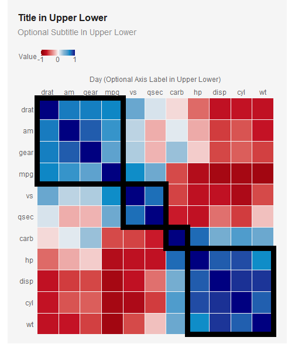

## Pairs plot

``` r
library(GGally) ## Needed for ggpairs function
dg = mtcars %>%
  select(mpg, cyl, wt, carb) %>%
  mutate(Cylinders = factor(cyl))

title = 'Title in Upper Lower'
g = ggpairs(dg, 
            aes(color = Cylinders, 
                fill  = Cylinders), 
            columns = c('mpg', 'wt', 'carb'),
            diag    = list(continuous = pub.density)) +
  labs(title    = title,
       subtitle = 'Optional Subtitle In Upper Lower',
       caption  = "Optional caption giving more info, X handle, or shameless promotion of pubtheme",
       x     = 'Horizontal Axis Label in Upper Lower',
       y     = 'Vertical Axis Label in Upper Lower') +
  theme_pub(type = 'pairs')
print(g)

## Save to a file using base_size = 36
gg = g +
  theme_pub(type      = 'pairs', 
            base_size = 36)

ggsave(filename = paste0("img/", gsub("%", " Perc", title), ".jpg"), 
       plot   = gg,
       width  = 20,   ## do not change
       height = 20,   ## can change from 20 if desired
       units  = 'in', ## do not change
       dpi    = 72)   ## do not change
```

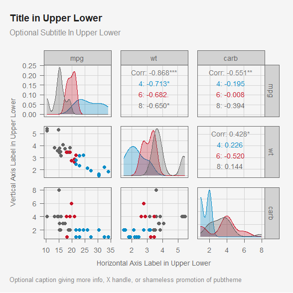

Note that since the object `g` resulting from using `ggpairs` is not a
`ggplot` object, `pub` can’t be used with it.

## Line plot

Since `name` and `value` will be more common column names when using
these in the wild, we’ll rename some columns to be name and value, to
simplify copying and pasting later.

Continuous variables for `x` seem to be more common, so we’ll convert
date to days for this example, so that copying and pasting later becomes
easier. We’ll use `toupper()` to avoid using variables with all
lowercase letters in the legend.

``` r
dg = economics_long %>%
  mutate(name  = toupper(variable), 
         days  = as.numeric(date - min(date)), 
         value = value01) %>%
  select(date, days, name, value)
head(dg)
#> # A tibble: 6 × 4
#>   date        days name     value
#>   <date>     <dbl> <chr>    <dbl>
#> 1 1967-07-01     0 PCE   0       
#> 2 1967-08-01    31 PCE   0.000265
#> 3 1967-09-01    62 PCE   0.000762
#> 4 1967-10-01    92 PCE   0.000471
#> 5 1967-11-01   123 PCE   0.000916
#> 6 1967-12-01   153 PCE   0.00157
```

``` r

title = "Title in Upper Lower" 
g = ggplot(dg, 
           aes(x     = days, 
               y     = value, 
               color = name)) +
  geom_line() +
  labs(title    = title,
       subtitle = 'Optional Subtitle In Upper Lower',
       caption  = "Optional caption giving more info, X handle, or shameless promotion of pubtheme",
       x     = 'Horizontal Axis Label in Upper Lower', 
       y     = 'Vertical Axis Label in Upper Lower', 
       color = 'Legend Label') +
  guides(color = guide_legend(nrow = 2))

g %>% 
  pub(type = 'line', 
      ylim = c(0, 1)) + 
  theme(legend.text.align = 0)

## Save to a file using base_size = 36
gg = g %>% 
  pub(type = 'line', 
      ylim = c(0, 1), 
      base_size = 36) + 
  theme(legend.text.align = 0)

ggsave(filename = paste0("img/", gsub("%", " Perc", title), ".jpg"), ## must have a subfolder called 'img'
       plot   = gg,
       width  = 20,   ## do not change
       height = 20,   ## can change from 20 if desired
       units  = 'in', ## do not change
       dpi    = 72)   ## do not change  
```

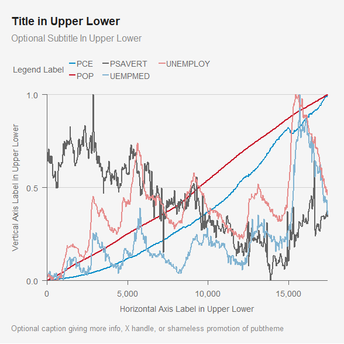

Note that once again we set breaks for the y-axis at the top, middle,
and bottom.

### Line plot with date

You can use the same code as Line Plot above (except use `x = date`),
and `pub` will detect the date scale and format appropriately. You can
change the format of the labels as shown below with `xlabels`.

``` r
title = "Title in Upper Lower" 
g = ggplot(dg, 
           aes(x     = date, 
               y     = value, 
               color = name)) +
  geom_line() +
  labs(title    = title,
       subtitle = 'Optional Subtitle In Upper Lower',
       caption  = "Optional caption giving more info, X handle, or shameless promotion of pubtheme",
       x     = 'Horizontal Axis Label in Upper Lower', 
       y     = 'Vertical Axis Label in Upper Lower', 
       color = 'Legend Label') +
  guides(color = guide_legend(nrow = 2))

g %>% 
  pub(type = 'line', 
      ylim = c(0, 1), 
      xbreaks = as.Date(c('1970-01-01', 
                          '1990-01-01', 
                          '2010-01-01')), ## optional
      xlabels = function(x) format(x, '%b%e, %Y')) + ## optional
  theme(legend.text.align = 0)
```


## Histogram

``` r
dg = economics %>%
  filter(date <= '2008-01-01') %>%
  rename(value = unemploy)

title = "Title in Upper Lower" 
g  = ggplot(dg, 
            aes(x = value)) +
  geom_histogram(fill     = pubblue, 
                 color    = pubbackgray, 
                 binwidth = 500) + ## set a reasonable binwidth
  labs(title    = title,
       subtitle = 'Optional Subtitle In Upper Lower',
       caption  = "Optional caption giving more info, X handle, or shameless promotion of pubtheme",
       x = 'Horizontal Axis Label in Upper Lower', ## Required.
       y = 'Count') 

g %>% 
  pub(type = 'hist')

## Save to a file using base_size = 36
gg = g %>% 
  pub(type = 'hist', 
      base_size = 36)

ggsave(filename = paste0("img/", gsub("%", " Perc", title), ".jpg"), 
       plot   = gg,
       width  = 20,   ## do not change
       height = 20,   ## can change from 20 if desired
       units  = 'in', ## do not change
       dpi    = 72)   ## do not change
```

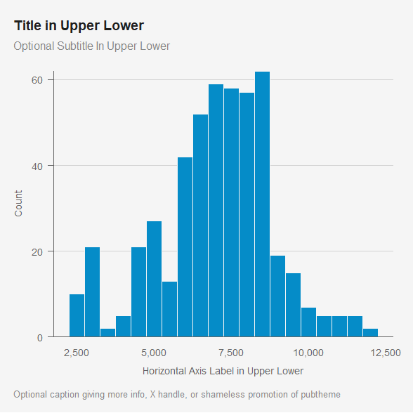

The `binwidth` will almost surely need to be changed for your data.

## Bar plot

We’ll use the `mtcars` data again, with some modifications. For
cylinder, we’ll add `-cylinder` to the numbers so it looks nice. We’ll
then convert it a factor so that we can specify the order. We’ll also
create a column called `max` which controls the length of the lightgray
bars in the background. Finally, we’ll rename `cyl` and `mpg` to `name`
and `value`, which will be convenient when copying and pasting this
code.

``` r
dg = mtcars %>%
  group_by(cyl) %>%
  summarise(mpg = mean(mpg)) %>%
  mutate(cyl = paste0(cyl, '-cylinder'),
         cyl = factor(cyl, 
                      levels = c('8-cylinder', 
                                 '6-cylinder', 
                                 '4-cylinder'))) %>% ## for background cars
  rename(name  = cyl, 
         value = mpg) 

## Use if you want the optional gray bars in the background.
## Change so that text fits and doesn't flow over the right side of the plot
x.max = 30 

title = "Title in Upper Lower" 
g = ggplot(dg, 
           aes(x = value, 
               y = name, 
               label = round(value,2))) +
  geom_col(aes(x = x.max),        ## optional background bars. 
           fill = publightgray, 
           width = 0.8) + 
  geom_col(width = 0.8) +       
  geom_text(hjust = -0.1) + ## optional numbers with reasonable number of digits
  labs(title    = title,
       subtitle = 'Optional Subtitle In Upper Lower',
       caption  = "Optional caption giving more info, X handle, or shameless promotion of pubtheme",
       x        = 'Horizontal Axis Label in Upper Lower', ## Optional. 
       y        = NULL)  ## Optional. Upper Lower.

g %>%
  pub(type = 'bar')

## Save to a file using base_size = 36
gg = g %>%
  pub(type      = 'bar',
      base_size = 36)

ggsave(filename = paste0("img/", gsub("%", " Perc", title), ".jpg"), ## must have a subfolder called 'img'
       plot   = gg,
       width  = 20,   ## do not change
       height = 15,   ## can change from 20 if desired. We use 15 here b/c there are only 3 bars
       units  = 'in', ## do not change
       dpi    = 72)   ## do not change
```

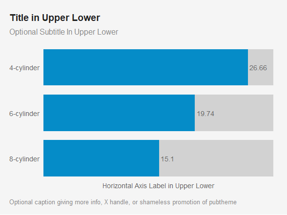

If you are using digits next to the bars, you can increase the `max` so
the text fits.

You may want to remove `x` and `y` axis titles. If not used, use
`x = NULL` and/or `y = NULL` above. Do not use `x = ''` and/or `y = ''`.
If you do use axes titles, they should be in Upper Lower.

## Grid plot

``` r
dg = airquality %>%
  mutate(Month = month.abb[Month],
         Month = factor(Month, levels = rev(month.abb[month.abb %in% Month])), 
         Day   = factor(Day, levels = 1:31)) %>% 
  rename(x = Day,
         y = Month,
         value = Temp)

## Do this so that all combos have a tile
dg = dg %>%
  complete(x, 
           y, 
           fill = list(value = NA))
head(dg)
#> # A tibble: 6 × 6
#>   x     y     Ozone Solar.R  Wind value
#>   <fct> <fct> <int>   <int> <dbl> <int>
#> 1 1     Sep      96     167   6.9    91
#> 2 1     Aug      39      83   6.9    81
#> 3 1     Jul     135     269   4.1    84
#> 4 1     Jun      NA     286   8.6    78
#> 5 1     May      41     190   7.4    67
#> 6 2     Sep      78     197   5.1    92
```

``` r

title = "Title in Upper Lower"
g = ggplot(dg, 
           aes(x    = x, 
               y    = y, 
               fill = value, 
               alpha = '')) + ## hacky way to add a legend for NA values. See below
  geom_tile(linewidth   = 0.4, 
            show.legend = T, 
            color       = pubdarkgray) +
  scale_fill_gradient(low      = pubgradgray,
                      high     = pubblue, 
                      na.value = pubmediumgray, ## same color as below
                      oob      = squish, 
                      breaks   = c(60, 75, 90)) +
  
  ## hacky way to add a legend for NA values
  scale_alpha_manual(values = NA) +              
  guides(alpha = guide_legend(
    title = "No data",
    override.aes = list(fill = pubmediumgray))) + ## same color as above
    
  labs(title    = title,
       subtitle = 'Optional Subtitle In Upper Lower',
       caption  = "Optional caption giving more info, X handle, or shameless promotion of pubtheme",
       x    = 'Day (Optional Axis Label in Upper Lower)', 
       y    = NULL, ## Optional
       fill = 'Value') 

g %>% 
  pub(type    = 'grid',
      xbreaks = seq(2, 32, by = 2))

## Save to a file using base_size = 36
gg = g %>%
  pub(type      = 'grid', 
      xbreaks   = seq(2, 32, by=2),
      base_size = 36)

ggsave(filename = paste0("img/", gsub("%", " Perc", title), ".jpg"), 
       plot   = gg,
       width  = 20,   ## do not change
       height = 12,   ## can change from 20 if desired. We use 12 here to make the tiles square
       units  = 'in', ## do not change
       dpi    = 72)   ## do not change
```

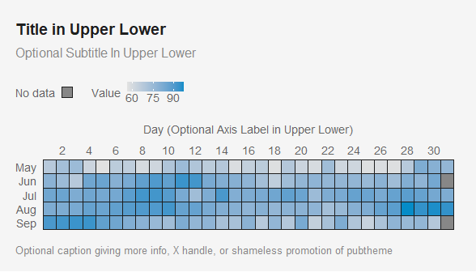

Interactive version, still in very early beta testing:

## Calendar heat map

Inspired by \[this post\]
(<https://thisisdaryn.netlify.app/post/making-a-calendar-visualization-with-ggplot2/>)

Note that we make the day numbers smaller by putting `size` *inside*
`aes`. This is so that the text will auto resize when different
`base_size` is used. If `size` is outside of `aes`, it will remain that
fixed number and won’t auto resize with different `base_size`.

First, we start with a `data.frame` that has `date` and `value` (the var
by which we’ll color the heatmap) columns.

``` r
df = data.frame(date = seq.Date(from = as.Date('2024-01-01'), 
                                to   = as.Date('2024-12-31'), 
                                by   = 'day'),
                value = rep(1:7, 
                            length.out = 366))
head(df)
#>         date value
#> 1 2024-01-01     1
#> 2 2024-01-02     2
#> 3 2024-01-03     3
#> 4 2024-01-04     4
#> 5 2024-01-05     5
#> 6 2024-01-06     6
```

``` r
## create month (for faceting), 
## day of week (columns), 
## week number (rows)
## and month-year (for faceting, for multi-year calendars)
dg = df %>%
  
  ## fill in missing dates from day 1 of the first month to 
  ## the last day of the last month, 
  ## which could be 31, 30, 29, or 28, depending on the last month
  complete(date = seq.Date(from =   floor_date(min(date), 'month'),
                           to   = ceiling_date(max(date), 'month') - 1,
                           by   = 'day'),
           fill = list(value = 0)) %>%
  
  mutate(month = months(date, 
                        abbreviate = F), 
         month = factor(month, 
                        levels = month.name),
         day.of.week = weekdays(date, 
                                abbreviate = T),
         day.of.week = factor(day.of.week, 
                              levels = c('Sun', 'Mon', 'Tue', 'Wed', 
                                         'Thu', 'Fri', 'Sat')),
         day  =  day(date),
         year = year(date), 
         month.year = paste(month, year)) %>%
  
  group_by(month, year) %>%
  
  mutate(week = ifelse(day == 1 | day.of.week == 'Sun', 1, 0), 
         week = cumsum(week), 
         day = as.character(day)) %>%
  
  ## fill in missing days of the week in first row and last row with NA
  complete(week, 
           day.of.week, 
           fill = list(value = NA, 
                       day = '')) ## to avoid warning about missing values
 
## plot
title = "Title in Upper Lower"
g = ggplot(dg, 
           aes(x = day.of.week, 
               y = week, 
               fill = value)) + ## hacky way to add a legend for NA values. See below
  geom_tile(linewidth   = 0.4,
            show.legend = T, 
            color       = pubdarkgray) +
  
  geom_text(aes(label = day, 
                size = week), ## so text resizes with base_size. Min/max is 2.5
            color = pubdarkgray, 
            hjust = 0, 
            vjust = 1,
            nudge_x = -0.45, 
            nudge_y =  0.45, 
            show.legend = F) +
  
  facet_wrap(~month, 
             scales = 'free_x', ## so day of week labels appear on each facet
             ncol = 4) +
  
  scale_fill_gradient(low      = pubgradgray,
                      high     = pubblue, 
                      na.value = pubbackgray, 
                      oob      = squish, 
                      breaks   = c(60, 75, 90)) +
  
  labs(title    = title,
       subtitle = 'Optional Subtitle In Upper Lower',
       caption  = "Optional caption giving more info, X handle, or shameless promotion of pubtheme",
       x    = NULL, 
       y    = NULL, ## Optional
       fill = 'Value') +
  guides(size = 'none') 

g %>% 
  pub(type = 'cal', 
      xlabels = c('Su', 'M', 'Tu', 'W', 
                  'Th', 'F', 'Sa'),
      ytrans = 'reverse') +
  theme(axis.text.x.top = element_text(
                      size   = 12*.75,
                      margin = margin(b = 5*1/72*1/3, unit = 'in'),
                      vjust  = 0))

  

## Save to a file using base_size = 36
gg = g %>%
  pub(type   = 'cal', 
      xlabels = c('Su', 'M', 'Tu', 'W', 
                  'Th', 'F', 'Sa'),
      ytrans = 'reverse',
      base_size = 36) +
  theme(axis.text.x.top = element_text(
                      size   = 36*.75,
                      margin = margin(b = 5*1/72*36/36, unit = 'in'),
                      vjust  = 0))

ggsave(filename = paste0("img/", gsub("%", " Perc", title), ".jpg"), 
       plot   = gg,
       width  = 20,   ## do not change
       height = 20,   ## can change from 20 if desired. We use 12 here to make the tiles square
       units  = 'in', ## do not change
       dpi    = 72)   ## do not change
```

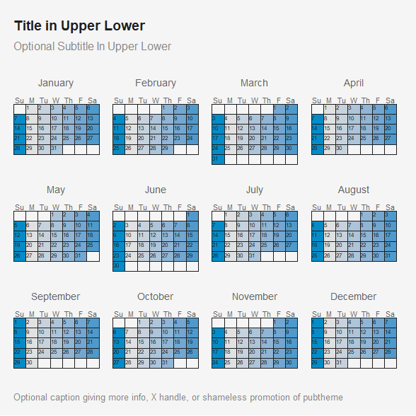

## Slope Chart

``` r
dg = economics_long %>%
  mutate(name = toupper(variable), 
         days = as.numeric(date - min(date)), 
         y= value01, 
         x = as.character(date)) %>%
  select(x, name, y) %>%
  filter(x %in% range(x), 
         name != 'PCE') %>% ## keep first and last date
  mutate(time = ifelse(x == min(x), "", "end")) %>%
  pivot_wider(names_from = time, 
              values_from = c(x, y), 
              names_sep = '') %>%
  mutate(diff = yend - y, 
         perc = diff/y*100, 
         label1 = paste0(name, ', ', 
                         round(y, 2)),
         label2 = paste0(
           round(yend, 2), ' (',
           sprintf("%+.2f", diff), '), ', ## show a plus when positive
           name
           ))
```

``` r

title = "Title in Upper Lower" 
g = ggplot(dg, 
           aes(x = x,
               y = y, 
               color = name, 
               size = 4, 
               linewidth = .25)) +
  
  ## lines
  geom_segment(aes(xend = xend,
                   yend = yend)) +

  ## text labels
  geom_text_repel(aes(label = label1, 
                      color = name),
                  #color = pubtextgray,
                  nudge_x   =  -0.08,
                  hjust     =  1, 
                  vjust     = 0.5,
                  direction = 'y', 
                  min.segment.length = 1) +
  
  geom_text_repel(aes(x     = xend,
                      y     = yend,
                      label = label2, 
                      color = name), 
                  #color = pubtextgray,
                  nudge_x = 0.08,
                  hjust   = 0, 
                  vjust   = 0.5,
                  direction = 'y', 
                  min.segment.length = 1) +
  
  ## points
  geom_point(show.legend = F) + 
  geom_point(show.legend = F, 
             aes(x = xend, 
                 y = yend)) + 
  
  labs(title    = title,
       subtitle = 'Optional Subtitle In Upper Lower',
       caption  = "Optional caption giving more info, X handle, or shameless promotion of pubtheme",
       x = 'Horizontal Axis Label in Upper Lower', ## Optional. 
       y = NULL)  +  ## Optional. Upper Lower.
  
  guides(size      = 'none', 
         linewidth = 'none', 
         color     = 'none') 

g %>% 
  pub(type = 'slope') 
 
## Save to a file using base_size = 36
gg = g %>%
  pub(type = 'slope',
      base_size = 36)

ggsave(filename = paste0("img/", gsub("%", " Perc", title), ".jpg"), ## must have a subfolder called 'img'
       plot   = gg,
       width  = 20,   ## do not change
       height = 20,   ## can change from 20 if desired. We use 15 here because there are only 5 barbells
       units  = 'in', ## do not change
       dpi    = 72)   ## do not change
```

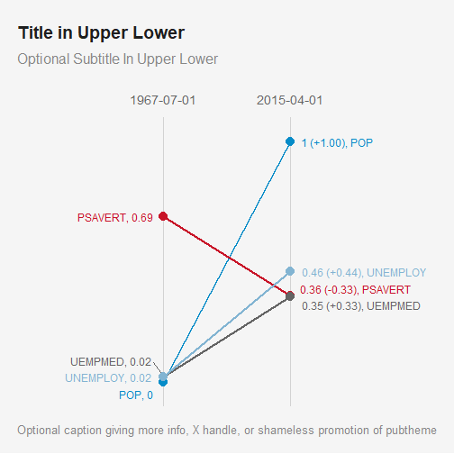

## Lollipop plot

We’ll make a horizontal lollipop plot. It can be used an alternative to
a bar plot, and it is often preferred, especially when the visualization
will eventually be printed since the lollipop plot used far less
ink/toner.

``` r

dg = airquality %>%
  mutate(Month = month.abb[Month],
         Month = factor(Month, 
                        levels = rev(month.abb))) %>% 
  group_by(Month) %>%
  summarise(Temp = mean(Temp)) %>%
  rename(name  = Month,
         value = Temp)


title = "Title in Upper Lower" 
g = ggplot(dg, 
           aes(x     = value, 
               y     = name, 
               label = round(value,2), 
               size  = 1,         ## these are constant put these in aes() anyway
               linewidth = .75)) +  ## so they change when base_size changes
  geom_segment(aes(x    = 0, 
                   xend = value, 
                   y    = name, 
                   yend = name), 
               color = pubred) +
  geom_point(color = pubred, 
             show.legend = F) + 
  geom_text(hjust = -0.3) + ## optional numbers with reasonable number of digits
  labs(title    = title,
       subtitle = 'Optional Subtitle In Upper Lower',
       caption  = "Optional caption giving more info, X handle, or shameless promotion of pubtheme",
       x = 'Horizontal Axis Label in Upper Lower', ## Optional. 
       y = NULL) +  ## Optional. Upper Lower.
  guides(size      = 'none', 
         linewidth = 'none')

g %>%
  pub(type = 'pop', 
      xlim = c(0, 120)) 

## Save to a file using base_size = 36
gg = g %>% 
  pub(type      = 'pop',
      xlim      = c(0, 120),
      base_size = 36)

ggsave(filename = paste0("img/", gsub("%", " Perc", title), ".jpg"), ## must have a subfolder called 'img'
       plot   = gg,
       width  = 20,   ## do not change
       height = 12,   ## can change from 20 if desired. We use 12 here because there are only 5 lollipops
       units  = 'in', ## do not change
       dpi    = 72)   ## do not change
```

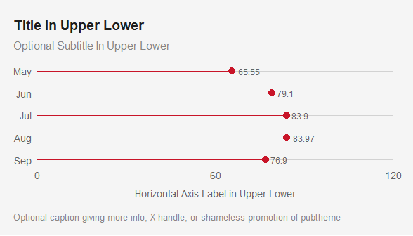

Same plot using `geom_linerange` instead of `geom_segment`. We have to
switch the `x` and `y` aesthetics and use `coord_flip`.

``` r
# title = "Title in Upper Lower" 
# g = ggplot(dg, 
#            aes(x     = name, 
#                y     = value, 
#                label = round(value,2), 
#                size  = 1,         ## these are constant put these in aes() anyway
#                linewidth = .75)) +  ## so they change when base_size changes
#   geom_linerange(aes(ymin = 0, 
#                      ymax = value), 
#                color = pubred) #+
#   # geom_point(color = pubred, 
#   #            show.legend = F) + 
#   # geom_text(vjust = -0.3) + ## optional numbers with reasonable number of digits
#   # coord_flip() + 
#   # labs(title    = title,
#   #      subtitle = 'Optional Subtitle In Upper Lower',
#   #      caption  = "Optional caption giving more info, X handle, or shameless promotion of pubtheme",
#   #      x = 'Horizontal Axis Label in Upper Lower', ## Optional. 
#   #      y = NULL) +  ## Optional. Upper Lower.
#   # guides(size      = 'none', 
#   #        linewidth = 'none')
# 
# g %>%
#   pub(type = 'pop', 
#       xlim = c(0, 120), ) 
# 
# ## Save to a file using base_size = 36
# gg = g %>% 
#   pub(type      = 'pop',
#       xlim      = c(0, 120),
#       base_size = 36)
# 
# ggsave(filename = paste0("img/", gsub("%", " Perc", title), ".jpg"), ## must have a subfolder called 'img'
#        plot   = gg,
#        width  = 20,   ## do not change
#        height = 12,   ## can change from 20 if desired. We use 12 here because there are only 5 lollipops
#        units  = 'in', ## do not change
#        dpi    = 72)   ## do not change
```

## Lollipop for discrete distributions

This still uses `type = 'pop'` but we’ll use a different template for
copying/pasting.

``` r
dg = data.frame(name  = 0:10, 
                value = dbinom(0:10, 10, .5))

title = "Title in Upper Lower" 
g = ggplot(dg, 
           aes(x     = name, 
               y     = value, 
               label = round(value,2), 
               size  = 5, 
               linewidth = 0.5)) +
  geom_point(color = pubred) + 
  geom_segment(aes(x    = name, 
                   xend = name, 
                   y    = 0, 
                   yend = value), 
               color = pubred) +
  geom_text(vjust = -1) + ## optional numbers with reasonable number of digits
  labs(title    = title,
       subtitle = 'Optional Subtitle In Upper Lower',
       caption  = "Optional caption giving more info, X handle, or shameless promotion of pubtheme",
       x = 'Horizontal Axis Label in Upper Lower', ## Optional. 
       y = NULL) +  ## Optional. Upper Lower.
  guides(size = 'none', 
         linewidth = 'none')
  
g %>% 
  pub(type    = 'pop', 
      xlim    = c(0, 10), 
      ylim    = c(0, .3), 
      xbreaks = 0:10)

## Save to a file using base_size = 36
gg = g %>% 
  pub(type      = 'pop', 
      xlim      = c(0, 10), 
      ylim      = c(0, .3), 
      xbreaks   = 0:10,
      base_size = 36)

ggsave(filename = paste0("img/", gsub("%", " Perc", title), ".jpg"), ## must have a subfolder called 'img'
       plot   = gg,
       width  = 20,   ## do not change
       height = 15,   ## can change from 20 if desired. We choose 15 here b/c the extra space isn't needed
       units  = 'in', ## do not change
       dpi    = 72)   ## do not change
```

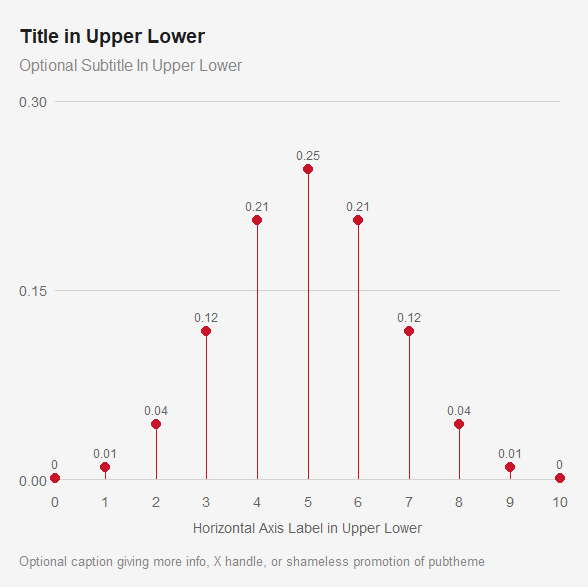

## Barbell plot

This still uses `type = 'pop'` but we’ll use a different template for
copying/pasting.

``` r
dg = airquality %>%
  mutate(Month = month.abb[Month],
         Month = factor(Month, 
                        levels = rev(month.abb))) %>% 
  group_by(Month) %>%
  summarise(x    = min(Temp), 
            xend = max(Temp)) %>%
  rename(name = Month)


title = "Title in Upper Lower" 
g = ggplot(dg, 
           aes(x = x,
               y = name, 
               size = 4, 
               linewidth = .5)) +
  geom_point(color = pubred) + 
  geom_point(color = pubred, 
             aes(x = xend)) + 
  geom_segment(aes(xend = xend, 
                   yend = name), 
               color = pubred) +
  geom_text(aes(label = round(x, 2)), 
            hjust = 1.5) + ## optional numbers with reasonable number of digits
  geom_text(aes(x     = xend, 
                label = round(xend, 2)), 
            hjust = -0.5) + ## optional numbers with reasonable number of digits
  labs(title    = title,
       subtitle = 'Optional Subtitle In Upper Lower',
       caption  = "Optional caption giving more info, X handle, or shameless promotion of pubtheme",
       x = 'Horizontal Axis Label in Upper Lower', ## Optional. 
       y = NULL) +  ## Optional. Upper Lower.
  guides(size      = 'none', 
         linewidth = 'none')

g %>% 
  pub(type = 'pop', 
      xlim = c(0, 120))

## Save to a file using base_size = 36
gg = g %>% 
  pub(type = 'pop', 
      xlim = c(0, 120), 
      base_size = 36)

ggsave(filename = paste0("img/", gsub("%", " Perc", title), ".jpg"), ## must have a subfolder called 'img'
       plot   = gg,
       width  = 20,   ## do not change
       height = 15,   ## can change from 20 if desired. We use 15 here because there are only 5 barbells
       units  = 'in', ## do not change
       dpi    = 72)   ## do not change
```

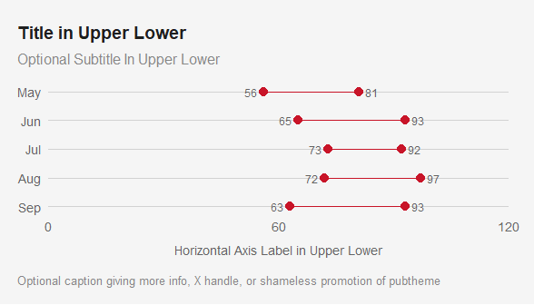

## Dot and Whiskers Plot

It is often desirable to visualize regression coefficients using a dot
and whiskers plot instead of showing a table of coefficients and
standard errors. We’ll make up a regression model and demonstrate that
here.

This still uses `type = 'pop'` but we’ll use a different template for
copying/pasting.

``` r
## standardize predictors so they are roughly the same scale
d = mtcars %>%
  mutate(wt   = scale(wt),  
         cyl  = scale(cyl), 
         disp = scale(disp), 
         hp   = scale(hp))

m1 = lm(mpg ~ wt + cyl + disp +  hp, 
        data = d)

#summary(m1)

dg = summary(m1)$coefficients %>% 
  as.data.frame() %>%
  rownames_to_column(var = 'var') %>%
  rename(coef = Estimate, 
         se   = `Std. Error`) %>%
  select(var, 
         coef, 
         se) %>%
  filter(var != '(Intercept)') %>%
  mutate(var = toupper(var), 
         label    = round(coef, 2),
         label.se = paste0(sprintf("%.1f", coef), 
                        ' \u00B1 ', ## unicode for +/-
                        sprintf("%.1f", se))) 

title = "Title in Upper Lower" 
g = ggplot(dg, 
           aes(x         = coef, 
               y         = var, 
               size      = 4, 
               linewidth = 0.5)) +
  geom_segment(aes(x     = coef - se, 
                   xend  = coef + se,
                   y     = var, 
                   yend  = var), 
               color = pubred) +
  geom_point(color = pubred) +
  geom_text(aes(label = label.se), 
            vjust = -1, 
            nudge_y = 0) + 
  geom_vline(xintercept = 0, 
             color      = pubmediumgray) +
  labs(title    = title,
       subtitle = 'Optional Subtitle In Upper Lower',
       caption  = "Optional caption giving more info, X handle, or shameless promotion of pubtheme",
       x = 'Coefficient', 
       y = NULL) + ## Optional. 
  guides(size      = 'none', 
         linewidth = 'none')
 
g %>% 
  pub(type = 'dot', 
      xlim = c(-5, 5))

## Save to a file using base_size = 36
gg = g %>% 
  pub(type      = 'dot', 
      xlim      = c(-5, 5),
      base_size = 36)

ggsave(filename = paste0("img/", gsub("%", " Perc", title), ".jpg"), 
       plot   = gg,
       width  = 20,   ## do not change
       height = 10,   ## can change from 20 if desired. We use 10 here because there are only 4 coefficients.
       units  = 'in', ## do not change
       dpi    = 72)   ## do not change
```

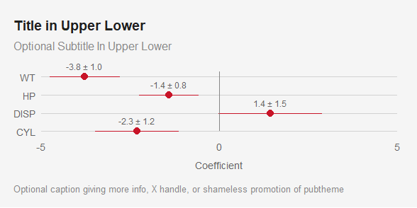

## Error bars

Use the same data as above

``` r
## standardize predictors so they are roughly the same scale
d = mtcars %>%
  mutate(wt   = scale(wt),  
         cyl  = scale(cyl), 
         disp = scale(disp), 
         hp   = scale(hp))

m1 = lm(mpg ~ wt + cyl + disp +  hp, 
        data = d)

dg = summary(m1)$coefficients %>% 
  as.data.frame() %>%
  rownames_to_column(var = 'var') %>%
  rename(coef = Estimate, 
         se   = `Std. Error`) %>%
  select(var, 
         coef, 
         se) %>%
  filter(var != '(Intercept)') %>%
  mutate(var = toupper(var), 
         label    = round(coef, 2),
         label.se = paste0(sprintf("%.1f", coef), 
                        ' \u00B1 ', ## unicode for +/-
                        sprintf("%.1f", se))) 
  

title = "Title in Upper Lower" 
g = ggplot(dg, 
           aes(x         = coef, 
               y         = var, 
               size      = 4, 
               linewidth = 0.5)) +
  geom_errorbarh(aes(xmin = coef - se, 
                     xmax = coef + se), 
                 color = pubred, 
                 height = 0.2) +
  geom_point(color = pubred) +
  geom_text(aes(label = label.se), 
            vjust = -1, 
            nudge_y = 0) + 
  geom_vline(xintercept = 0, 
             color      = pubmediumgray) +
  labs(title    = title,
       subtitle = 'Optional Subtitle In Upper Lower',
       caption  = "Optional caption giving more info, X handle, or shameless promotion of pubtheme",
       x = 'Coefficient', 
       y = NULL) + ## Optional. 
  guides(size      = 'none', 
         linewidth = 'none')
 
g %>% 
  pub(type = 'dot', 
      xlim = c(-5, 5))

## Save to a file using base_size = 36
gg = g %>% 
  pub(type      = 'dot', 
      xlim      = c(-5, 5),
      base_size = 36)

ggsave(filename = paste0("img/", gsub("%", " Perc", title), ".jpg"), 
       plot   = gg,
       width  = 20,   ## do not change
       height = 12,   ## can change from 20 if desired. We use 10 here because there are only 4 coefficients.
       units  = 'in', ## do not change
       dpi    = 72)   ## do not change
```

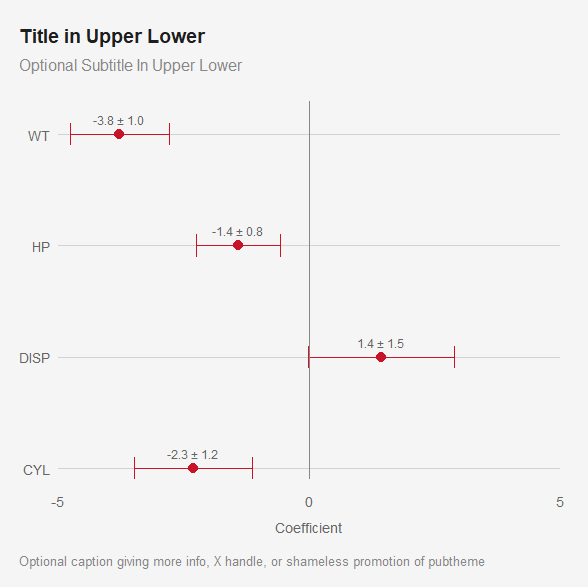

For vertical error bars, use `geom_errorbar()` instead of
`geom_errorbarh()`.

## Faceting

We’ll use our scatter plot example, but with `facet_wrap` to make
separate plots for each `cyl`, and we add a `facet = T` argument to make
some formatting more appropriate for faceted plots.

``` r
dg = mtcars %>%
  select(wt, 
         mpg, 
         cyl) %>%
  mutate(cyl = paste0(cyl, '-cylinder')) %>%
  rename(name = cyl)

title = "Title in Upper Lower" ## to be used by ggplot and ggsave
g = ggplot(dg, 
           aes(x     = wt, 
               y     = mpg, 
               size  = mpg, 
               color = name)) +
  geom_point(show.legend = F) +
  facet_wrap(~name, 
             nrow = 1) +
  labs(title    = title,
       subtitle = 'Optional Subtitle In Upper Lower',
       caption  = "Optional caption giving more info, X handle, or shameless promotion of pubtheme",
       x = 'Horizontal Axis Label in Upper Lower',
       y = 'Vertical Axis Label in Upper Lower')

g %>% 
  pub(xlim  = c(0, 6), 
      ylim  = c(0, 40), 
      facet = T)

## Save to a file using base_size = 36
gg = g %>%
  pub(xlim      = c(0, 6), 
      ylim      = c(0, 40), 
      facet     = T, 
      base_size = 36)

ggsave(filename = paste0("img/", gsub("%", " Perc", title), ".jpg"), ## must have a subfolder called 'img'
       plot   = gg,
       width  = 20,   ## do not change
       height = 13,   ## can change from 20 if desired. Here we choose 13 so each subplot is square
       units  = 'in', ## do not change
       dpi    = 72)   ## do not change
```

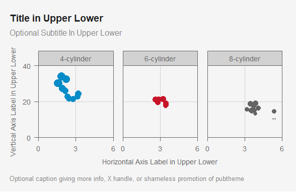

## Timeline

Let’s make up some data. Let’s also define a new “`reverse_trans`”
function called `reverse2_trans`.

``` r
current.year = as.numeric(format(Sys.Date(), "%Y"))

dg = data.frame(date = 
                  as.Date(
                    c(paste0(current.year,
                             c('-01-01', 
                               '-07-04', 
                               '-12-25', 
                               '-12-31')),
                      paste0(current.year + 1,                                        
                             c('-01-01', 
                               '-07-04', 
                               '-12-25', 
                               '-12-31')))), 
                text = c("New Year's Day", 
                         "Independence Day",
                         "Christmas Day",
                         "New Year's Eve", 
                         "New Year's Day", 
                         "Independence Day",
                         "Christmas Day",
                         "New Year's Eve")) %>%
  mutate(text = paste0(text, ', ', date), 
         name = case_when(grepl('Christmas', text) ~ 'Christmas', 
                          grepl('Indep'    , text) ~ 'Indep', 
                          TRUE ~ 'Other'), 
         name = factor(name, levels = c('Christmas', 
                                        'Indep', 
                                        'Other')))
dg
#>         date                         text      name
#> 1 2024-01-01   New Year's Day, 2024-01-01     Other
#> 2 2024-07-04 Independence Day, 2024-07-04     Indep
#> 3 2024-12-25    Christmas Day, 2024-12-25 Christmas
#> 4 2024-12-31   New Year's Eve, 2024-12-31     Other
#> 5 2025-01-01   New Year's Day, 2025-01-01     Other
#> 6 2025-07-04 Independence Day, 2025-07-04     Indep
#> 7 2025-12-25    Christmas Day, 2025-12-25 Christmas
#> 8 2025-12-31   New Year's Eve, 2025-12-31     Other
```

``` r

## Now make the timeline using ggrepel for the text
library(ggrepel) ## for  geom_text_repel() or geom_label_repel()

## Function for reverse date axes 
## Copied from https://github.com/tidyverse/ggplot2/issues/4014
## Will be used by pub. If you are using theme_pub instead of pub, 
## you will need this function and scale_y_continuous(trans = 'reverse2'). 
reverse2_trans <- function() {
  trans_new(
    "reverse2",
    function(x) -1 * as.numeric(x), # Force values to be numeric for Date objects
    function(x) -1 * as.numeric(x)
  )
}

## Define breaks, title, and plot
breaks = as.Date(paste0(current.year + 0:2, 
                        '-01-01'))

title = "Title in Upper Lower" ## to be used by ggplot and ggsave
g = ggplot(dg, 
           aes(x     = 0, 
               y     = date, 
               color = name, 
               label = text)) +
  geom_segment(aes(x    = 0, 
                   xend = 0, 
                   y    = min(date), 
                   yend = max(date)), 
               show.legend = F, 
               color       = publightgray) +
  geom_point(show.legend = F) +
  geom_label_repel(nudge_x     = 1,
                   hjust       = 0, 
                   direction   = 'y',
                   show.legend = F) +
  labs(title    = title,
       subtitle = 'Optional Subtitle In Upper Lower',
       caption  = "Optional caption, X handle, or shameless promotion of pubtheme",
       x = '',
       y = '') 

g %>% 
  pub(type    = 'timeline', 
      xlim    = c(0, 5), 
      ybreaks = breaks,
      ylabels = function(x) format(x, '%b %d, %Y'), 
      ytrans  = 'reverse2')

## Save to a file using base_size = 36
gg = g %>%
  pub(type      = 'timeline', 
      xlim      = c(0, 5), 
      ybreaks   = breaks,
      ylabels   = function(x) format(x, '%b %d, %Y'), 
      ytrans    = 'reverse2',
      base_size = 36)

ggsave(filename = paste0("img/", gsub("%", " Perc", title), ".jpg"), ## must have a subfolder called 'img'
       plot   = gg,  
       width  = 20,   ## do not change
       height = 30,   ## can change if you want. Here we made it longer to have more space
       units  = 'in', ## do not change
       dpi    = 72)   ## do not change
```

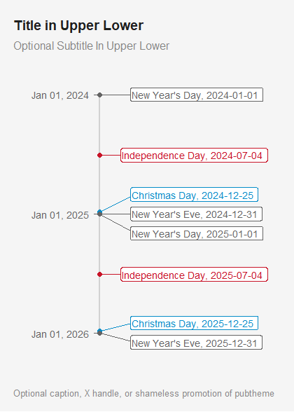

## Default colors

This theme changes your default ggplot colors to those found in
`colors.r`. The palette for discrete color scales
`scale_colour_discrete` and `scale_fill_discrete` consists of red, blue,
gray, light red, and light blue, as seen in the Line Plot above. Recall
that if you want to undo the changes made by this theme, you can use
`restore.ggplot.defaults()` at any time.

If more than 5-6 colors are needed, a 14-color colorblind friendly
palette `cb.pal` can be used by adding
`+ scale_color_manual(values = cb.pal)` or
`+ scale_fill_manual( values = cb.pal)` to a plot. For example,

``` r
dg = mtcars %>%
  mutate(gear = paste0(gear, ' gear'), 
         cyl  = paste0(cyl , ' cyl'  ), 
         name = paste0(gear, ', ', cyl)) 

title = "Title in Upper Lower" ## to be used by ggplot and ggsave

g = ggplot(dg, 
           aes(x = wt, 
               y = mpg, 
               color = name)) +
  geom_point() +
  facet_grid(cyl ~ gear) +
  labs(title    = title,
       subtitle = 'Optional Subtitle In Upper Lower',
       caption  = "Optional caption giving more info, X handle, or shameless promotion of pubtheme",
       x     = 'Horizontal Axis Label in Upper Lower',
       y     = 'Vertical Axis Label in Upper Lower', 
       color = 'Gears and Cylinders') +
  scale_color_manual(values = cb.pal) +
  guides(color = guide_legend(nrow = 3))

g %>% 
  pub(xlim  = c(0, 6), 
      ylim  = c(0, 40), 
      facet = T)
```

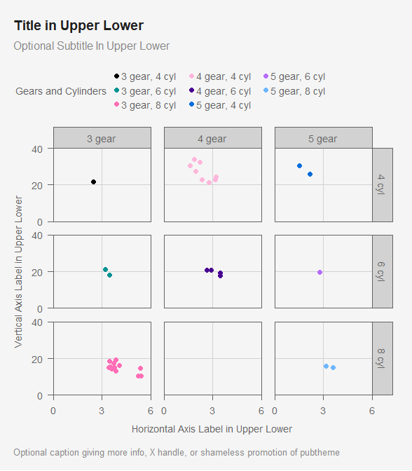

## Maps

``` r

dg = data.frame(city = c('New York', 'Los Angeles'), 
                lat  = c( 40.7128,   34.0522),
                lon  = c(-74.0060, -118.2437))

title = "Title in Upper Lower"
g = ggplot(dg, 
           aes(x = lon, 
               y = lat)) +
  borders('state', 
          colour = publightgray) +
  geom_point(color = pubred) +
  labs(title    = title, 
       subtitle = 'Optional Subtitle In Upper Lower',
       caption  = "Optional caption giving more info, X handle, or shameless promotion of pubtheme") 

g %>% 
  pub(type = 'map')
```

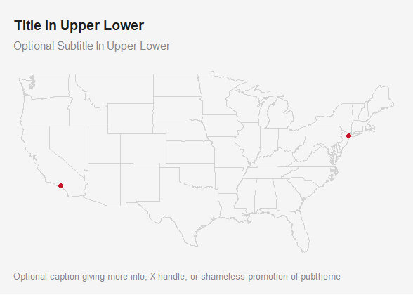

## Hex bins

The function `geom_hex` can be used for making a heat map with hexagonal
bins. Those can be colored by count.

``` r
dg = economics

title = 'Title in Upper Lower'

g = ggplot(dg, 
           aes(x = psavert, 
               y = uempmed)) +
  geom_hex(color = pubbackgray,
           bins  = 20, 
           show.legend = TRUE) +
  scale_fill_gradient(low      = pubbackgray,
                      high     = pubblue,
                      na.value = pubmediumgray,
                      oob      = squish,
                      limits = c(0,20),
                      breaks = c(0, 10, 20)
                      ) +
  guides(fill = guide_colourbar())+
  labs(title    = title, 
       subtitle = 'Optional Subtitle In Upper Lower',
       caption  = "Optional caption giving more info, X handle, or shameless promotion of pubtheme", 
       x    = 'Personal Savings Rate', 
       y    = 'Median Duration of Unemployment', 
       fill = 'Observations')

g %>% 
  pub(xlim = c(0, 20), 
      ylim = c(0, 30)) 

## Save to a file using base_size = 36
gg = g %>%
  pub(xlim      = c(0, 20), 
      ylim      = c(0, 30),
      base_size = 36)

ggsave(filename = paste0("img/", gsub("%", " Perc", title), ".jpg"), ## must have a subfolder called 'img'
       plot   = gg,   
       width  = 20,   ## do not change
       height = 20,   ## can change from 20 if desired
       units  = 'in', ## do not change
       dpi    = 72)   ## do not change
```


If you want to size the hexagons by count, and color by another
variable, the only way I know is to use `geom_star` with
`starshape = 'hexagon'`. The following code creates some data with
`cell` ID, cell location `x` and `y`, the `count` to be used for size,
and a column `mean.pop` to be used for fill. This is a reasonable
solution but it is not ideal and is still under development.

``` r
library(hexbin)
library(ggstar)

df = economics

h = hexbin(x     = df$psavert,
           y     = df$uempmed,
           xbins = 20, 
           IDs   = TRUE)

hh =  data.frame(hcell2xy(h),
                 cell  = h@cell,
                 count = h@count, 
                 xcm   = h@xcm, 
                 ycm   = h@ycm)
head(hh)
#>         x        y cell count      xcm  ycm
#> 1  9.7500 4.000000   11     2  9.90000 4.10
#> 2 10.5050 4.000000   12     4 10.40000 4.25
#> 3 11.2600 4.000000   13     3 11.23333 4.40
#> 4 12.0150 4.000000   14     3 11.83333 4.30
#> 5 13.5250 4.000000   16     1 13.30000 4.10
#> 6  4.8425 4.917987   25     1  4.50000 5.20
```

``` r

df$cell = h@cID

dg <- df %>%
  group_by(cell) %>%
  summarise(n   = n(),           ## for size
            pop = sum(pop)) %>%  ## for fill
  ungroup() %>%
  mutate(mean.pop = pop/n) %>%
  right_join(hh, 
             by = "cell") %>%
  select(cell, x, y, 
         count, n, 
         pop, mean.pop)

title = 'Title in Upper Lower'
g = ggplot(dg, 
           aes(x = x, 
               y = y, 
               fill = mean.pop, 
               size = n)) +
  geom_star(colour      = pubbackgray,
            starshape   = 'hexagon',
            show.legend = T) +
  labs(title    = title, 
       subtitle = 'Optional Subtitle In Upper Lower',
       caption  = "Optional caption giving more info, X handle, or shameless promotion of pubtheme", 
       x    = 'Personal Savings Rate', 
       y    = 'Median Duration of Unemployment', 
       size = 'Observations', 
       fill = 'Mean Population') +
  scale_fill_gradient(guide = 'legend', 
                      low   = publightgray, 
                      high  = pubblue) +
  guides(size = guide_legend(nrow = 3, 
                             override.aes = list(fill = pubdarkgray)), 
         fill = guide_legend(nrow = 2, 
                             override.aes = list(size = 5)))

g %>% 
  pub(xlim = c(0, 20), 
      ylim = c(0, 30)) +
  scale_size(range = c(1, 5)) ## adjust the max, and maybe the min, manually 

## Save to a file using base_size = 36
gg = g %>%
  pub(xlim      = c(0, 20), 
      ylim      = c(0, 30),
      base_size = 36) + 
  scale_size(range = c(1, 5)*3) ## same as above, but times 3

ggsave(filename = paste0("img/", gsub("%", " Perc", title), ".jpg"), ## must have a subfolder called 'img'
       plot   = gg,   
       width  = 20,   ## do not change
       height = 20,   ## can change, but hexagons may look distorted
       units  = 'in', ## do not change
       dpi    = 72)   ## do not change
```

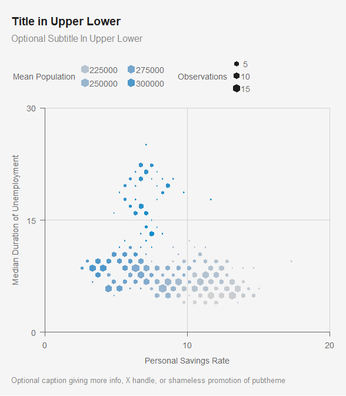

## Images as labels

Let’s use the `ggtext` <https://wilkelab.org/ggtext/> package to add
images as labels.

First let’s choose a couple of images, and create a data frame with the
image URLs, the country name and GDP per capita (taken from
<https://en.wikipedia.org/wiki/List_of_countries_by_GDP_(nominal)_per_capita>
on 11/21/2023).

First, let’s get a couple of PNG files from the web.

``` r
# us = 'https://upload.wikimedia.org/wikipedia/en/thumb/a/a4/Flag_of_the_United_States.svg/35px-Flag_of_the_United_States.svg.png'
# can = 'https://upload.wikimedia.org/wikipedia/commons/thumb/d/d9/Flag_of_Canada_%28Pantone%29.svg/35px-Flag_of_Canada_%28Pantone%29.svg.png'
# download.file(url = us , destfile = "img/US.png" , method='curl')
# download.file(url = can, destfile = "img/CAN.png", method='curl')

## if you need to write a PNG file from an image you can use `writePNG`
# us  = png::readPNG(us )
# can = png::readPNG(can) 
# writePNG('img/US.png')
# writePNG('img/CAN.png')
```

``` r
library(ggtext)
us = 'img/US.png'
can = 'img/CAN.png'
df = data.frame(country = c('USA', 'Canada'), 
                GDP.per.cap = c(80412, 53247), 
                image   = c(us, can))
df
#>   country GDP.per.cap       image
#> 1     USA       80412  img/US.png
#> 2  Canada       53247 img/CAN.png
```

Now create some HTML code to display the images with the country names.
You will likely need to change the width and height, but note that after
saving the visualization to a file, the image will appear smaller than
it appears on screen.

``` r
df = df %>% 
  mutate(label = paste0(""))
df
#>   country GDP.per.cap       image
#> 1     USA       80412  img/US.png
#> 2  Canada       53247 img/CAN.png
#>                                                                                                   label
#> 1  
#> 2 
```

One way to add images is to use `geom_image` from `ggimage`. This
results in a stretched looking image, but we’ll leave it here anyway.

``` r
library(ggimage)
title = "Title in Upper Lower" 
g = ggplot(df, 
           aes(x     = GDP.per.cap, 
               y     = country, 
               size  = .5,         ## these are constant put these in aes() anyway
               linewidth = .5)) +  ## so they change when base_size changes
  geom_point(color = pubred, 
             show.legend = F) + 
  geom_segment(aes(x    = 0, 
                   xend = GDP.per.cap, 
                   y    = country, 
                   yend = country), 
               color = pubred) +
  geom_image(aes(image = image), 
             size = .05, 
             by = 'height', 
             nudge_x = 12000) + 
  labs(title    = title,
       subtitle = 'Optional Subtitle In Upper Lower',
       caption  = "Optional caption giving more info, X handle, or shameless promotion of pubtheme",
       x = 'Horizontal Axis Label in Upper Lower', ## Optional. 
       y = NULL) +  ## Optional. Upper Lower.
  guides(size      = 'none', 
         linewidth = 'none')

g %>%
  pub(type = 'pop', 
      xlim = c(0, 100000)) 

## Save to a file using base_size = 36
gg = g %>%
  pub(type = 'pop', 
      xlim = c(0, 100000),
      base_size = 36) 

ggsave(filename = paste0("img/", gsub("%", " Perc", title), ".jpg"), ## must have a subfolder called 'img'
       plot   = gg,
       width  = 20,   ## do not change
       height = 20,   ## can change from 20 if desired. We use 12 here because there are only 5 lollipops
       units  = 'in', ## do not change
       dpi    = 72)   ## do not change
```

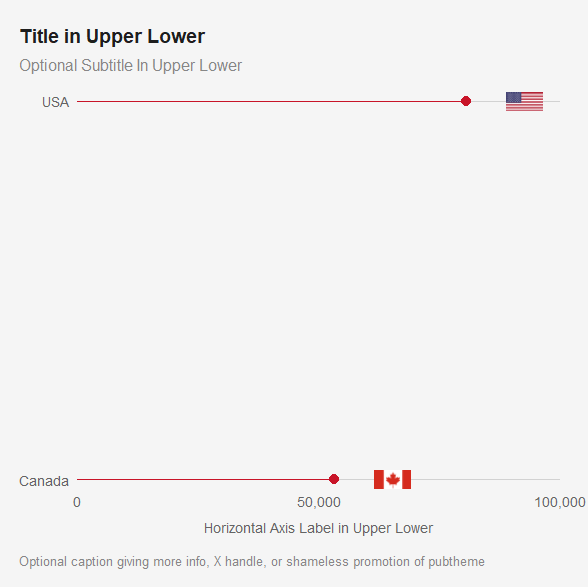

Now we’ll use `geom_richtext` instead of `geom_text` to add labels to
points. These images have a better aspect ratio.

``` r
title = "Title in Upper Lower" 
g = ggplot(df, 
           aes(x     = GDP.per.cap, 
               y     = country, 
               label = label, 
               size  = 10,         ## these are constant put these in aes() anyway
               linewidth = .5)) +  ## so they change when base_size changes
  geom_point(color = pubred, 
             show.legend = F) + 
  geom_segment(aes(x    = 0, 
                   xend = GDP.per.cap, 
                   y    = country, 
                   yend = country), 
               color = pubred) +
  geom_richtext(hjust = -0.2, 
                fill = NA, 
                label.color = NA) + 
  labs(title    = title,
       subtitle = 'Optional Subtitle In Upper Lower',
       caption  = "Optional caption giving more info, X handle, or shameless promotion of pubtheme",
       x = 'Horizontal Axis Label in Upper Lower', ## Optional. 
       y = NULL) +  ## Optional. Upper Lower.
  guides(size      = 'none', 
         linewidth = 'none')

g %>%
  pub(type = 'pop', 
      xlim = c(0, 100000),
      base_size = 12) + 
  theme(axis.text.y = element_markdown()) ## render the HTML code

## Save to a file using base_size = 36
gg = g %>%
  pub(type = 'pop', 
      xlim = c(0, 100000),
      base_size = 36) +
  theme(axis.text.y = element_markdown()) 

ggsave(filename = "img/flag.example.jpg", ## must have a subfolder called 'img'
       plot   = gg,
       width  = 20,   ## do not change
       height = 12,   ## can change from 20 if desired. We use 12 here because there are only 5 lollipops
       units  = 'in', ## do not change
       dpi    = 72)   ## do not change
```

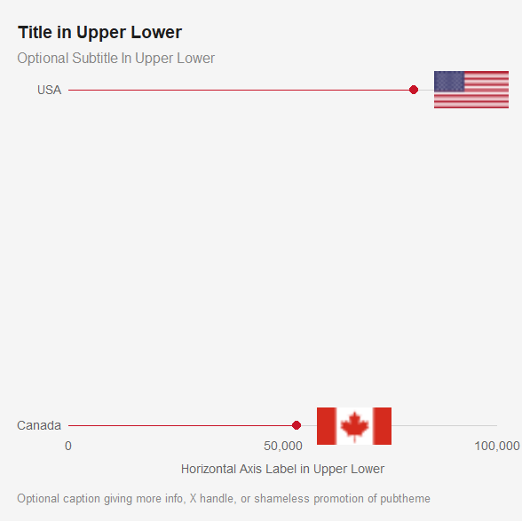

The images are smaller and less fuzzy when saved using `ggsave`:

!(img/flag.example.jpg)

## Images as axes labels

For this we can use `label` as the y-axis label and use
`theme(axis.text.y = element_markdown())` to render the HTML code.

``` r
title = "Title in Upper Lower" 
g = ggplot(df, 
           aes(x     = GDP.per.cap, 
               y     = label, 
               label = round(GDP.per.cap,2), 
               size  = 12,         ## these are constant put these in aes() anyway
               linewidth = .5)) +  ## so they change when base_size changes
  geom_point(color = pubred, 
             show.legend = F) + 
  geom_segment(aes(x    = 0, 
                   xend = GDP.per.cap, 
                   y    = label, 
                   yend = label), 
               color = pubred) +
  geom_text(hjust = -0.3) + ## optional numbers with reasonable number of digits
  labs(title    = title,
       subtitle = 'Optional Subtitle In Upper Lower',
       caption  = "Optional caption giving more info, X handle, or shameless promotion of pubtheme",
       x = 'Horizontal Axis Label in Upper Lower', ## Optional. 
       y = NULL) +  ## Optional. Upper Lower.
  guides(size      = 'none', 
         linewidth = 'none')

g %>%
  pub(type = 'pop', 
      xlim = c(0, 100000),
      base_size = 12) +
  theme(axis.text.y = element_markdown())

## Save to a file using base_size = 36
gg = g %>%
  pub(type = 'pop', 
      xlim = c(0, 100000),
      base_size = 36) +
  theme(axis.text.y = element_markdown())

ggsave(filename = paste0("img/", gsub("%", " Perc", title), ".jpg"), ## must have a subfolder called 'img'
       plot   = gg,
       width  = 20,   ## do not change
       height = 12,   ## can change from 20 if desired. We use 12 here because there are only 5 lollipops
       units  = 'in', ## do not change
       dpi    = 72)   ## do not change
```

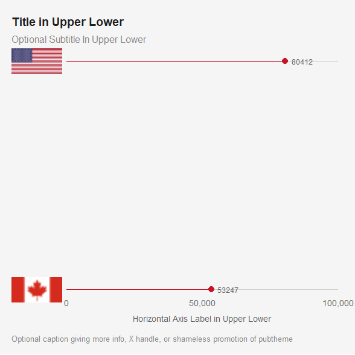

## plotly

You can use `layout_pub` to get similar formatting for `plotly` figures
that use `ggplotly` or `plot_ly`. This is under development. Only using
`type = 'scatter'` with `plot_ly` is currently supported. Others may
work and will be added “soon”, according to some definition of “soon”.

Here is an example using `plot_ly`:

``` r
library(htmlwidgets)
dg = mtcars %>% 
  select(wt, 
         mpg, 
         cyl) %>%
  mutate(cyl = factor(cyl)) %>%
  rownames_to_column('name')

base_size = 12
title = 'Title in Upper Lower'
p = plot_ly(data = dg,
            width  = 1440*base_size/36, 
            height = 1440*base_size/36) %>%
  add_trace(type   = 'scatter', 
            mode   = 'markers',
            x      = ~wt, 
            y      = ~mpg, 
            color  = ~cyl, 
            size   = ~mpg,
            text   = ~name,
            colors = default.pal[1:3], ## change 3 to number of categories
            marker = list(opacity = 1),# add size = 30*base_size/36 if no size above
            hovertemplate = paste0( 
              "<b>%{text}</b><br>",
              "%{yaxis.title.text}: %{y:,.3f}<br>",
              "%{xaxis.title.text}: %{x:,.2f}<br>",
              "<extra></extra>")) %>%
  layoutpub(type        = 'scatter', 
            base_size   = base_size, 
            subtitle    = T, 
            caption     = F, 
            legend.rows = 1) %>%
  layout(
    title = list(text = maketitle(title     = 'Title In Upper Lower',
                                  subtitle  = 'Optional Subtitle in Upper Lower',
                                  base_size = base_size)), 
    xaxis = list(title    = list(text = 'Wt'),
                 range    = c(0,    6),
                 tickvals = c(0, 3, 6)),
    yaxis = list(title    = list(text = 'MPG'), 
                 range    = c(0,     40), 
                 tickvals = c(0, 20, 40)), 
    legend = list(title = list(text = 'Cylinders'))
    )
print(p)

htmlwidgets::saveWidget(widget = p,
                        file   = paste0("img/", 
                                        gsub("%", " Perc", title),
                                        ".html"),
                        libdir = "lib", 
                        selfcontained = F)
```

Click
[here](https://bmacgtpm.github.io/pubtheme/img/Title%20in%20Upper%20Lower.html)
or click on the image below to view the interactive version of the plot.

``` r
knitr::include_url("https://bmacgtpm.github.io/pubtheme/img/Title%20in%20Upper%20Lower.html")
```

<iframe src="https://bmacgtpm.github.io/pubtheme/img/Title%20in%20Upper%20Lower.html" width="100%" height="400px" data-external="1">
</iframe>

Note that the subtitle and the caption at the bottom of the plot are
currently not functioning properly.

## ggplotly

Here is an example using `ggplotly`.

``` r
dg = mtcars %>% 
  select(wt, 
         mpg, 
         cyl) %>%
  mutate(Cylinders = as.factor(cyl)) %>%
  rename(MPG    = mpg, 
         Weight = wt) %>%
  rownames_to_column('name')

g = ggplot(dg,
           aes(x     = Weight, 
               y     = MPG, 
               color = Cylinders, 
               text  = name)) +
  geom_point() +
  labs(title    = title,
       subtitle = 'Optional Subtitle In Upper Lower',
       caption  = "Optional caption giving more info, X handle, or shameless promotion of pubtheme",
       x    = 'Horizontal Axis Label in Upper Lower',
       y    = 'Vertical Axis Label in Upper Lower', 
       size = "MPG")

## Convert g to plotly using ggplotly
base_size = 12
p = g %>% 
  #labs(title = paste0('<b>', title, '</b>'))
  pub(xlim = c(0, 6),
      ylim = c(0, 40)) %>%
  ggplotly(width   = 1440*base_size/36, 
           height  = 1440*base_size/36, 
           tooltip = c('x', 'y', 'color', 'text')) %>%
  layoutpub(type      = 'scatter', 
            base_size = base_size, 
            subtitle  = T, 
            caption   = F, 
            legend.rows = 1) %>%
  style(marker.sizeref = 1.5)
p
```

<div id="htmlwidget-95e885aaa9abcb6976c6" style="width:480px;height:480px;" class="plotly html-widget"></div>
<script type="application/json" data-for="htmlwidget-95e885aaa9abcb6976c6">{"x":{"data":[{"x":[2.3199999999999998,3.1899999999999999,3.1499999999999999,2.2000000000000002,1.615,1.835,2.4649999999999999,1.9350000000000001,2.1400000000000001,1.5129999999999999,2.7799999999999998],"y":[22.800000000000001,24.399999999999999,22.800000000000001,32.399999999999999,30.399999999999999,33.899999999999999,21.5,27.300000000000001,26,30.399999999999999,21.399999999999999],"text":["Weight: 2.320<br />MPG: 22.8<br />Cylinders: 4<br />Datsun 710","Weight: 3.190<br />MPG: 24.4<br />Cylinders: 4<br />Merc 240D","Weight: 3.150<br />MPG: 22.8<br />Cylinders: 4<br />Merc 230","Weight: 2.200<br />MPG: 32.4<br />Cylinders: 4<br />Fiat 128","Weight: 1.615<br />MPG: 30.4<br />Cylinders: 4<br />Honda Civic","Weight: 1.835<br />MPG: 33.9<br />Cylinders: 4<br />Toyota Corolla","Weight: 2.465<br />MPG: 21.5<br />Cylinders: 4<br />Toyota Corona","Weight: 1.935<br />MPG: 27.3<br />Cylinders: 4<br />Fiat X1-9","Weight: 2.140<br />MPG: 26.0<br />Cylinders: 4<br />Porsche 914-2","Weight: 1.513<br />MPG: 30.4<br />Cylinders: 4<br />Lotus Europa","Weight: 2.780<br />MPG: 21.4<br />Cylinders: 4<br />Volvo 142E"],"type":"scatter","mode":"markers","marker":{"autocolorscale":false,"color":"rgba(5,140,200,1)","opacity":1,"size":8.8188976377952759,"symbol":"circle","line":{"width":1.8897637795275593,"color":"rgba(5,140,200,1)"},"sizeref":1.5},"hoveron":"points","name":"4","legendgroup":"4","showlegend":true,"xaxis":"x","yaxis":"y","hoverinfo":"text","frame":null},{"x":[2.6200000000000001,2.875,3.2149999999999999,3.46,3.4399999999999999,3.4399999999999999,2.77],"y":[21,21,21.399999999999999,18.100000000000001,19.199999999999999,17.800000000000001,19.699999999999999],"text":["Weight: 2.620<br />MPG: 21.0<br />Cylinders: 6<br />Mazda RX4","Weight: 2.875<br />MPG: 21.0<br />Cylinders: 6<br />Mazda RX4 Wag","Weight: 3.215<br />MPG: 21.4<br />Cylinders: 6<br />Hornet 4 Drive","Weight: 3.460<br />MPG: 18.1<br />Cylinders: 6<br />Valiant","Weight: 3.440<br />MPG: 19.2<br />Cylinders: 6<br />Merc 280","Weight: 3.440<br />MPG: 17.8<br />Cylinders: 6<br />Merc 280C","Weight: 2.770<br />MPG: 19.7<br />Cylinders: 6<br />Ferrari Dino"],"type":"scatter","mode":"markers","marker":{"autocolorscale":false,"color":"rgba(200,20,40,1)","opacity":1,"size":8.8188976377952759,"symbol":"circle","line":{"width":1.8897637795275593,"color":"rgba(200,20,40,1)"},"sizeref":1.5},"hoveron":"points","name":"6","legendgroup":"6","showlegend":true,"xaxis":"x","yaxis":"y","hoverinfo":"text","frame":null},{"x":[3.4399999999999999,3.5699999999999998,4.0700000000000003,3.73,3.7799999999999998,5.25,5.4240000000000004,5.3449999999999998,3.52,3.4350000000000001,3.8399999999999999,3.8450000000000002,3.1699999999999999,3.5699999999999998],"y":[18.699999999999999,14.300000000000001,16.399999999999999,17.300000000000001,15.199999999999999,10.4,10.4,14.699999999999999,15.5,15.199999999999999,13.300000000000001,19.199999999999999,15.800000000000001,15],"text":["Weight: 3.440<br />MPG: 18.7<br />Cylinders: 8<br />Hornet Sportabout","Weight: 3.570<br />MPG: 14.3<br />Cylinders: 8<br />Duster 360","Weight: 4.070<br />MPG: 16.4<br />Cylinders: 8<br />Merc 450SE","Weight: 3.730<br />MPG: 17.3<br />Cylinders: 8<br />Merc 450SL","Weight: 3.780<br />MPG: 15.2<br />Cylinders: 8<br />Merc 450SLC","Weight: 5.250<br />MPG: 10.4<br />Cylinders: 8<br />Cadillac Fleetwood","Weight: 5.424<br />MPG: 10.4<br />Cylinders: 8<br />Lincoln Continental","Weight: 5.345<br />MPG: 14.7<br />Cylinders: 8<br />Chrysler Imperial","Weight: 3.520<br />MPG: 15.5<br />Cylinders: 8<br />Dodge Challenger","Weight: 3.435<br />MPG: 15.2<br />Cylinders: 8<br />AMC Javelin","Weight: 3.840<br />MPG: 13.3<br />Cylinders: 8<br />Camaro Z28","Weight: 3.845<br />MPG: 19.2<br />Cylinders: 8<br />Pontiac Firebird","Weight: 3.170<br />MPG: 15.8<br />Cylinders: 8<br />Ford Pantera L","Weight: 3.570<br />MPG: 15.0<br />Cylinders: 8<br />Maserati Bora"],"type":"scatter","mode":"markers","marker":{"autocolorscale":false,"color":"rgba(100,100,100,1)","opacity":1,"size":8.8188976377952759,"symbol":"circle","line":{"width":1.8897637795275593,"color":"rgba(100,100,100,1)"},"sizeref":1.5},"hoveron":"points","name":"8","legendgroup":"8","showlegend":true,"xaxis":"x","yaxis":"y","hoverinfo":"text","frame":null}],"layout":{"margin":{"t":97.999999999999986,"r":16.666666666666664,"b":61.999999999999993,"l":61.999999999999993,"pad":0},"plot_bgcolor":"#F5F5F5","paper_bgcolor":"#F5F5F5","font":{"color":"#646464","family":"Arial","size":12},"title":{"text":"<b> Title in Upper Lower <\/b>","font":{"color":"#1E1E1E","family":"Arial","size":16.666666666666664},"x":0,"xref":"container","pad":{"t":30,"b":30,"l":16.666666666666664,"r":16.666666666666664},"xanchor":"left","y":1,"yanchor":"top","yref":"container"},"xaxis":{"domain":[0,1],"automargin":true,"type":"linear","autorange":false,"range":[0,6],"tickmode":"array","ticktext":["0","3","6"],"tickvals":[0,3,6],"categoryorder":"array","categoryarray":["0","3","6"],"nticks":3,"ticks":"outside","tickcolor":"#646464","ticklen":6.6666666666666661,"tickwidth":0.66666666666666663,"showticklabels":true,"tickfont":{"color":"#646464","family":"Arial","size":12},"tickangle":-0,"showline":true,"linecolor":"#646464","linewidth":0.66666666666666663,"showgrid":true,"gridcolor":"#D2D2D2","gridwidth":0.66666666666666663,"zeroline":false,"anchor":"y","title":{"text":"Horizontal Axis Label in Upper Lower","font":{"color":"#646464","family":"Arial","size":12},"standoff":10},"hoverformat":".2f","tick0":0,"mirror":true,"ticklabelstep":1,"layer":"below traces"},"yaxis":{"domain":[0,1],"automargin":true,"type":"linear","autorange":false,"range":[0,40],"tickmode":"array","ticktext":["0","20","40"],"tickvals":[0,20,40],"categoryorder":"array","categoryarray":["0","20","40"],"nticks":null,"ticks":"outside","tickcolor":"#646464","ticklen":6.6666666666666661,"tickwidth":0.66666666666666663,"showticklabels":true,"tickfont":{"color":"#646464","family":"Arial","size":12},"tickangle":-0,"showline":true,"linecolor":"#646464","linewidth":0.66666666666666663,"showgrid":true,"gridcolor":"#D2D2D2","gridwidth":0.66666666666666663,"zeroline":false,"anchor":"x","title":{"text":"Vertical Axis Label in Upper Lower","font":{"color":"#646464","family":"Arial","size":12},"standoff":6.6666666666666661},"hoverformat":".2f","tick0":0,"mirror":true,"ticklabelstep":1,"layer":"below traces"},"shapes":[{"type":"rect","fillcolor":null,"line":{"color":null,"width":0,"linetype":[]},"yref":"paper","xref":"paper","x0":0,"x1":1,"y0":0,"y1":1}],"showlegend":true,"legend":{"bgcolor":"#F5F5F5","bordercolor":"transparent","borderwidth":0.44094488188976372,"font":{"color":"#646464","family":"Arial","size":12},"title":{"text":"Cylinders","font":{"color":"#646464","family":"Arial","size":12}},"grouptitlefont":{"family":"Arial","color":"#646464"},"orientation":"h","itemclick":"toggleothers","itemdoubleclick":"toggle","itemsizing":"constant","itemwidth":3.333333333333333,"xref":"paper","x":-0.105,"xanchor":"left","y":1.03,"yanchor":"bottom","tracegroupgap":6.6666666666666661,"valign":"top"},"hovermode":"closest","width":480,"height":480,"barmode":"relative","autosize":true,"hoverlabel":{"bgcolor":"#F5F5F5"},"colorway":["#058CC8","#C81428","#646464","#82B4D2","#E68C8C","#035478","#780C18","#D2D2D2"],"colorscale":["#D2D2D2","#058CC8"]},"config":{"doubleClick":"reset","modeBarButtonsToAdd":["hoverclosest","hovercompare"],"showSendToCloud":false},"source":"A","attrs":{"973441526262":{"x":{},"y":{},"colour":{},"text":{},"type":"scatter"}},"cur_data":"973441526262","visdat":{"973441526262":["function (y) ","x"]},"highlight":{"on":"plotly_click","persistent":false,"dynamic":false,"selectize":false,"opacityDim":0.20000000000000001,"selected":{"opacity":1},"debounce":0},"shinyEvents":["plotly_hover","plotly_click","plotly_selected","plotly_relayout","plotly_brushed","plotly_brushing","plotly_clickannotation","plotly_doubleclick","plotly_deselect","plotly_afterplot","plotly_sunburstclick"],"base_url":"https://plot.ly"},"evals":[],"jsHooks":[]}</script>

``` r

htmlwidgets::saveWidget(widget = p,
                        file   = paste0("img/", gsub("%", " Perc", title), ".html"),
                        libdir = "lib",
                        selfcontained = F)
```

Note that the subtitle does not currently display. And the points in the
legend are different sizes for some reason \#shrugs.

As with non-interactive plots above, you can use `pub` to save a lot of
typing if you are ok with accepting more default settings. If you use
`pub` with `int = TRUE` (`int` for interactive), the `ggplot` object
will be converted to a `plotly` object using the `ggplotly` and
`layoutpub` code above. You’ll just need to specify the arguments
`subtitle`, `caption` and `legend.rows` required by `layoutpub`. This is
in development and works for this example but may not work for other
plots.

``` r
g %>% 
  pub(xlim = c(0, 6),
      ylim = c(0, 40), 
      int  = T,
      tooltip = c('x', 'y', 'color', 'text'), 
      subtitle  = T, 
      caption   = F, 
      legend.rows = 1) 
```

<div id="htmlwidget-9c8ca2de41825b4743b3" style="width:480px;height:480px;" class="plotly html-widget"></div>
<script type="application/json" data-for="htmlwidget-9c8ca2de41825b4743b3">{"x":{"data":[{"x":[2.3199999999999998,3.1899999999999999,3.1499999999999999,2.2000000000000002,1.615,1.835,2.4649999999999999,1.9350000000000001,2.1400000000000001,1.5129999999999999,2.7799999999999998],"y":[22.800000000000001,24.399999999999999,22.800000000000001,32.399999999999999,30.399999999999999,33.899999999999999,21.5,27.300000000000001,26,30.399999999999999,21.399999999999999],"text":["Weight: 2.320<br />MPG: 22.8<br />Cylinders: 4<br />Datsun 710","Weight: 3.190<br />MPG: 24.4<br />Cylinders: 4<br />Merc 240D","Weight: 3.150<br />MPG: 22.8<br />Cylinders: 4<br />Merc 230","Weight: 2.200<br />MPG: 32.4<br />Cylinders: 4<br />Fiat 128","Weight: 1.615<br />MPG: 30.4<br />Cylinders: 4<br />Honda Civic","Weight: 1.835<br />MPG: 33.9<br />Cylinders: 4<br />Toyota Corolla","Weight: 2.465<br />MPG: 21.5<br />Cylinders: 4<br />Toyota Corona","Weight: 1.935<br />MPG: 27.3<br />Cylinders: 4<br />Fiat X1-9","Weight: 2.140<br />MPG: 26.0<br />Cylinders: 4<br />Porsche 914-2","Weight: 1.513<br />MPG: 30.4<br />Cylinders: 4<br />Lotus Europa","Weight: 2.780<br />MPG: 21.4<br />Cylinders: 4<br />Volvo 142E"],"type":"scatter","mode":"markers","marker":{"autocolorscale":false,"color":"rgba(5,140,200,1)","opacity":1,"size":8.8188976377952759,"symbol":"circle","line":{"width":1.8897637795275593,"color":"rgba(5,140,200,1)"},"sizeref":1.5},"hoveron":"points","name":"4","legendgroup":"4","showlegend":true,"xaxis":"x","yaxis":"y","hoverinfo":"text","frame":null},{"x":[2.6200000000000001,2.875,3.2149999999999999,3.46,3.4399999999999999,3.4399999999999999,2.77],"y":[21,21,21.399999999999999,18.100000000000001,19.199999999999999,17.800000000000001,19.699999999999999],"text":["Weight: 2.620<br />MPG: 21.0<br />Cylinders: 6<br />Mazda RX4","Weight: 2.875<br />MPG: 21.0<br />Cylinders: 6<br />Mazda RX4 Wag","Weight: 3.215<br />MPG: 21.4<br />Cylinders: 6<br />Hornet 4 Drive","Weight: 3.460<br />MPG: 18.1<br />Cylinders: 6<br />Valiant","Weight: 3.440<br />MPG: 19.2<br />Cylinders: 6<br />Merc 280","Weight: 3.440<br />MPG: 17.8<br />Cylinders: 6<br />Merc 280C","Weight: 2.770<br />MPG: 19.7<br />Cylinders: 6<br />Ferrari Dino"],"type":"scatter","mode":"markers","marker":{"autocolorscale":false,"color":"rgba(200,20,40,1)","opacity":1,"size":8.8188976377952759,"symbol":"circle","line":{"width":1.8897637795275593,"color":"rgba(200,20,40,1)"},"sizeref":1.5},"hoveron":"points","name":"6","legendgroup":"6","showlegend":true,"xaxis":"x","yaxis":"y","hoverinfo":"text","frame":null},{"x":[3.4399999999999999,3.5699999999999998,4.0700000000000003,3.73,3.7799999999999998,5.25,5.4240000000000004,5.3449999999999998,3.52,3.4350000000000001,3.8399999999999999,3.8450000000000002,3.1699999999999999,3.5699999999999998],"y":[18.699999999999999,14.300000000000001,16.399999999999999,17.300000000000001,15.199999999999999,10.4,10.4,14.699999999999999,15.5,15.199999999999999,13.300000000000001,19.199999999999999,15.800000000000001,15],"text":["Weight: 3.440<br />MPG: 18.7<br />Cylinders: 8<br />Hornet Sportabout","Weight: 3.570<br />MPG: 14.3<br />Cylinders: 8<br />Duster 360","Weight: 4.070<br />MPG: 16.4<br />Cylinders: 8<br />Merc 450SE","Weight: 3.730<br />MPG: 17.3<br />Cylinders: 8<br />Merc 450SL","Weight: 3.780<br />MPG: 15.2<br />Cylinders: 8<br />Merc 450SLC","Weight: 5.250<br />MPG: 10.4<br />Cylinders: 8<br />Cadillac Fleetwood","Weight: 5.424<br />MPG: 10.4<br />Cylinders: 8<br />Lincoln Continental","Weight: 5.345<br />MPG: 14.7<br />Cylinders: 8<br />Chrysler Imperial","Weight: 3.520<br />MPG: 15.5<br />Cylinders: 8<br />Dodge Challenger","Weight: 3.435<br />MPG: 15.2<br />Cylinders: 8<br />AMC Javelin","Weight: 3.840<br />MPG: 13.3<br />Cylinders: 8<br />Camaro Z28","Weight: 3.845<br />MPG: 19.2<br />Cylinders: 8<br />Pontiac Firebird","Weight: 3.170<br />MPG: 15.8<br />Cylinders: 8<br />Ford Pantera L","Weight: 3.570<br />MPG: 15.0<br />Cylinders: 8<br />Maserati Bora"],"type":"scatter","mode":"markers","marker":{"autocolorscale":false,"color":"rgba(100,100,100,1)","opacity":1,"size":8.8188976377952759,"symbol":"circle","line":{"width":1.8897637795275593,"color":"rgba(100,100,100,1)"},"sizeref":1.5},"hoveron":"points","name":"8","legendgroup":"8","showlegend":true,"xaxis":"x","yaxis":"y","hoverinfo":"text","frame":null}],"layout":{"margin":{"t":97.999999999999986,"r":16.666666666666664,"b":61.999999999999993,"l":61.999999999999993,"pad":0},"plot_bgcolor":"#F5F5F5","paper_bgcolor":"#F5F5F5","font":{"color":"#646464","family":"Arial","size":12},"title":{"text":"<b> Title in Upper Lower <\/b>","font":{"color":"#1E1E1E","family":"Arial","size":16.666666666666664},"x":0,"xref":"container","pad":{"t":30,"b":30,"l":16.666666666666664,"r":16.666666666666664},"xanchor":"left","y":1,"yanchor":"top","yref":"container"},"xaxis":{"domain":[0,1],"automargin":true,"type":"linear","autorange":false,"range":[0,6],"tickmode":"array","ticktext":["0","3","6"],"tickvals":[0,3,6],"categoryorder":"array","categoryarray":["0","3","6"],"nticks":3,"ticks":"outside","tickcolor":"#646464","ticklen":6.6666666666666661,"tickwidth":0.66666666666666663,"showticklabels":true,"tickfont":{"color":"#646464","family":"Arial","size":12},"tickangle":-0,"showline":true,"linecolor":"#646464","linewidth":0.66666666666666663,"showgrid":true,"gridcolor":"#D2D2D2","gridwidth":0.66666666666666663,"zeroline":false,"anchor":"y","title":{"text":"Horizontal Axis Label in Upper Lower","font":{"color":"#646464","family":"Arial","size":12},"standoff":10},"hoverformat":".2f","tick0":0,"mirror":true,"ticklabelstep":1,"layer":"below traces"},"yaxis":{"domain":[0,1],"automargin":true,"type":"linear","autorange":false,"range":[0,40],"tickmode":"array","ticktext":["0","20","40"],"tickvals":[0,20,40],"categoryorder":"array","categoryarray":["0","20","40"],"nticks":null,"ticks":"outside","tickcolor":"#646464","ticklen":6.6666666666666661,"tickwidth":0.66666666666666663,"showticklabels":true,"tickfont":{"color":"#646464","family":"Arial","size":12},"tickangle":-0,"showline":true,"linecolor":"#646464","linewidth":0.66666666666666663,"showgrid":true,"gridcolor":"#D2D2D2","gridwidth":0.66666666666666663,"zeroline":false,"anchor":"x","title":{"text":"Vertical Axis Label in Upper Lower","font":{"color":"#646464","family":"Arial","size":12},"standoff":6.6666666666666661},"hoverformat":".2f","tick0":0,"mirror":true,"ticklabelstep":1,"layer":"below traces"},"shapes":[{"type":"rect","fillcolor":null,"line":{"color":null,"width":0,"linetype":[]},"yref":"paper","xref":"paper","x0":0,"x1":1,"y0":0,"y1":1}],"showlegend":true,"legend":{"bgcolor":"#F5F5F5","bordercolor":"transparent","borderwidth":0.44094488188976372,"font":{"color":"#646464","family":"Arial","size":12},"title":{"text":"Cylinders","font":{"color":"#646464","family":"Arial","size":12}},"grouptitlefont":{"family":"Arial","color":"#646464"},"orientation":"h","itemclick":"toggleothers","itemdoubleclick":"toggle","itemsizing":"constant","itemwidth":3.333333333333333,"xref":"paper","x":-0.105,"xanchor":"left","y":1.03,"yanchor":"bottom","tracegroupgap":6.6666666666666661,"valign":"top"},"hovermode":"closest","width":480,"height":480,"barmode":"relative","autosize":true,"hoverlabel":{"bgcolor":"#F5F5F5"},"colorway":["#058CC8","#C81428","#646464","#82B4D2","#E68C8C","#035478","#780C18","#D2D2D2"],"colorscale":["#D2D2D2","#058CC8"]},"config":{"doubleClick":"reset","modeBarButtonsToAdd":["hoverclosest","hovercompare"],"showSendToCloud":false},"source":"A","attrs":{"97347ef67aff":{"x":{},"y":{},"colour":{},"text":{},"type":"scatter"}},"cur_data":"97347ef67aff","visdat":{"97347ef67aff":["function (y) ","x"]},"highlight":{"on":"plotly_click","persistent":false,"dynamic":false,"selectize":false,"opacityDim":0.20000000000000001,"selected":{"opacity":1},"debounce":0},"shinyEvents":["plotly_hover","plotly_click","plotly_selected","plotly_relayout","plotly_brushed","plotly_brushing","plotly_clickannotation","plotly_doubleclick","plotly_deselect","plotly_afterplot","plotly_sunburstclick"],"base_url":"https://plot.ly"},"evals":[],"jsHooks":[]}</script>

If you want to customize the tooltip (e.g. when you are unable to
specify the order that you want), you can create a `text` column that
has the information you want, in the order that you want. You can also
include HTML code to format the text.

In the example below, the car name is bolded using `<b> </b>`, and
Weight, MPG, and Cylinders appear as additional information. The
function `tooltip.text` helps make it easier. You can list *unquoted*
column names in the order you want them. The entries in the tooltip are
typically of the from “ColumnName: Value”. If there is a `name` column
listed, it automatically makes it bold and removes `name:` from the
tooltip, like this:

**Toyota Corolla** <br> Weight: 1.835 <br> MPG: 33.9 <br> Cylinders: 4

``` r
dg = mtcars %>% 
  select(wt, 
         mpg, 
         cyl) %>%
  mutate(Cylinders = as.factor(cyl)) %>%
  rename(MPG   = mpg, 
         Weight = wt) %>%
  rownames_to_column('name') %>%
  mutate(text = tooltip.text(name, 
                             Weight, 
                             MPG, 
                             Cylinders))

g = ggplot(dg,
           aes(x = Weight, 
               y = MPG, 
               color = Cylinders, 
               #size = MPG, ## this messes up the legend position or margins
               text = text)) +
geom_point() +
labs(title    = title,
     subtitle = 'Optional Subtitle In Upper Lower',
     caption  = "Optional caption giving more info, X handle, or shameless promotion of pubtheme",
     x    = 'Horizontal Axis Label in Upper Lower',
     y    = 'Vertical Axis Label in Upper Lower', 
     #size = "MPG"
     )

g %>% 
  pub(xlim        = c(0, 6),
      ylim        = c(0, 40), 
      int         = T,
      tooltip     = 'text',
      subtitle    = T, 
      caption     = F, 
      legend.rows = 1) %>%
  layout(legend = list(itemsizing = 'constant'))
```

<div id="htmlwidget-118709d1c0ffe0747223" style="width:480px;height:480px;" class="plotly html-widget"></div>
<script type="application/json" data-for="htmlwidget-118709d1c0ffe0747223">{"x":{"data":[{"x":[2.3199999999999998,3.1899999999999999,3.1499999999999999,2.2000000000000002,1.615,1.835,2.4649999999999999,1.9350000000000001,2.1400000000000001,1.5129999999999999,2.7799999999999998],"y":[22.800000000000001,24.399999999999999,22.800000000000001,32.399999999999999,30.399999999999999,33.899999999999999,21.5,27.300000000000001,26,30.399999999999999,21.399999999999999],"text":["<b>Datsun 710<\/b><br>Weight: 2.320<br>MPG: 22.8<br>Cylinders: 4","<b>Merc 240D<\/b><br>Weight: 3.190<br>MPG: 24.4<br>Cylinders: 4","<b>Merc 230<\/b><br>Weight: 3.150<br>MPG: 22.8<br>Cylinders: 4","<b>Fiat 128<\/b><br>Weight: 2.200<br>MPG: 32.4<br>Cylinders: 4","<b>Honda Civic<\/b><br>Weight: 1.615<br>MPG: 30.4<br>Cylinders: 4","<b>Toyota Corolla<\/b><br>Weight: 1.835<br>MPG: 33.9<br>Cylinders: 4","<b>Toyota Corona<\/b><br>Weight: 2.465<br>MPG: 21.5<br>Cylinders: 4","<b>Fiat X1-9<\/b><br>Weight: 1.935<br>MPG: 27.3<br>Cylinders: 4","<b>Porsche 914-2<\/b><br>Weight: 2.140<br>MPG: 26.0<br>Cylinders: 4","<b>Lotus Europa<\/b><br>Weight: 1.513<br>MPG: 30.4<br>Cylinders: 4","<b>Volvo 142E<\/b><br>Weight: 2.780<br>MPG: 21.4<br>Cylinders: 4"],"type":"scatter","mode":"markers","marker":{"autocolorscale":false,"color":"rgba(5,140,200,1)","opacity":1,"size":8.8188976377952759,"symbol":"circle","line":{"width":1.8897637795275593,"color":"rgba(5,140,200,1)"},"sizeref":1.5},"hoveron":"points","name":"4","legendgroup":"4","showlegend":true,"xaxis":"x","yaxis":"y","hoverinfo":"text","frame":null},{"x":[2.6200000000000001,2.875,3.2149999999999999,3.46,3.4399999999999999,3.4399999999999999,2.77],"y":[21,21,21.399999999999999,18.100000000000001,19.199999999999999,17.800000000000001,19.699999999999999],"text":["<b>Mazda RX4<\/b><br>Weight: 2.620<br>MPG: 21.0<br>Cylinders: 6","<b>Mazda RX4 Wag<\/b><br>Weight: 2.875<br>MPG: 21.0<br>Cylinders: 6","<b>Hornet 4 Drive<\/b><br>Weight: 3.215<br>MPG: 21.4<br>Cylinders: 6","<b>Valiant<\/b><br>Weight: 3.460<br>MPG: 18.1<br>Cylinders: 6","<b>Merc 280<\/b><br>Weight: 3.440<br>MPG: 19.2<br>Cylinders: 6","<b>Merc 280C<\/b><br>Weight: 3.440<br>MPG: 17.8<br>Cylinders: 6","<b>Ferrari Dino<\/b><br>Weight: 2.770<br>MPG: 19.7<br>Cylinders: 6"],"type":"scatter","mode":"markers","marker":{"autocolorscale":false,"color":"rgba(200,20,40,1)","opacity":1,"size":8.8188976377952759,"symbol":"circle","line":{"width":1.8897637795275593,"color":"rgba(200,20,40,1)"},"sizeref":1.5},"hoveron":"points","name":"6","legendgroup":"6","showlegend":true,"xaxis":"x","yaxis":"y","hoverinfo":"text","frame":null},{"x":[3.4399999999999999,3.5699999999999998,4.0700000000000003,3.73,3.7799999999999998,5.25,5.4240000000000004,5.3449999999999998,3.52,3.4350000000000001,3.8399999999999999,3.8450000000000002,3.1699999999999999,3.5699999999999998],"y":[18.699999999999999,14.300000000000001,16.399999999999999,17.300000000000001,15.199999999999999,10.4,10.4,14.699999999999999,15.5,15.199999999999999,13.300000000000001,19.199999999999999,15.800000000000001,15],"text":["<b>Hornet Sportabout<\/b><br>Weight: 3.440<br>MPG: 18.7<br>Cylinders: 8","<b>Duster 360<\/b><br>Weight: 3.570<br>MPG: 14.3<br>Cylinders: 8","<b>Merc 450SE<\/b><br>Weight: 4.070<br>MPG: 16.4<br>Cylinders: 8","<b>Merc 450SL<\/b><br>Weight: 3.730<br>MPG: 17.3<br>Cylinders: 8","<b>Merc 450SLC<\/b><br>Weight: 3.780<br>MPG: 15.2<br>Cylinders: 8","<b>Cadillac Fleetwood<\/b><br>Weight: 5.250<br>MPG: 10.4<br>Cylinders: 8","<b>Lincoln Continental<\/b><br>Weight: 5.424<br>MPG: 10.4<br>Cylinders: 8","<b>Chrysler Imperial<\/b><br>Weight: 5.345<br>MPG: 14.7<br>Cylinders: 8","<b>Dodge Challenger<\/b><br>Weight: 3.520<br>MPG: 15.5<br>Cylinders: 8","<b>AMC Javelin<\/b><br>Weight: 3.435<br>MPG: 15.2<br>Cylinders: 8","<b>Camaro Z28<\/b><br>Weight: 3.840<br>MPG: 13.3<br>Cylinders: 8","<b>Pontiac Firebird<\/b><br>Weight: 3.845<br>MPG: 19.2<br>Cylinders: 8","<b>Ford Pantera L<\/b><br>Weight: 3.170<br>MPG: 15.8<br>Cylinders: 8","<b>Maserati Bora<\/b><br>Weight: 3.570<br>MPG: 15.0<br>Cylinders: 8"],"type":"scatter","mode":"markers","marker":{"autocolorscale":false,"color":"rgba(100,100,100,1)","opacity":1,"size":8.8188976377952759,"symbol":"circle","line":{"width":1.8897637795275593,"color":"rgba(100,100,100,1)"},"sizeref":1.5},"hoveron":"points","name":"8","legendgroup":"8","showlegend":true,"xaxis":"x","yaxis":"y","hoverinfo":"text","frame":null}],"layout":{"margin":{"t":97.999999999999986,"r":16.666666666666664,"b":61.999999999999993,"l":61.999999999999993,"pad":0},"plot_bgcolor":"#F5F5F5","paper_bgcolor":"#F5F5F5","font":{"color":"#646464","family":"Arial","size":12},"title":{"text":"<b> Title in Upper Lower <\/b>","font":{"color":"#1E1E1E","family":"Arial","size":16.666666666666664},"x":0,"xref":"container","pad":{"t":30,"b":30,"l":16.666666666666664,"r":16.666666666666664},"xanchor":"left","y":1,"yanchor":"top","yref":"container"},"xaxis":{"domain":[0,1],"automargin":true,"type":"linear","autorange":false,"range":[0,6],"tickmode":"array","ticktext":["0","3","6"],"tickvals":[0,3,6],"categoryorder":"array","categoryarray":["0","3","6"],"nticks":3,"ticks":"outside","tickcolor":"#646464","ticklen":6.6666666666666661,"tickwidth":0.66666666666666663,"showticklabels":true,"tickfont":{"color":"#646464","family":"Arial","size":12},"tickangle":-0,"showline":true,"linecolor":"#646464","linewidth":0.66666666666666663,"showgrid":true,"gridcolor":"#D2D2D2","gridwidth":0.66666666666666663,"zeroline":false,"anchor":"y","title":{"text":"Horizontal Axis Label in Upper Lower","font":{"color":"#646464","family":"Arial","size":12},"standoff":10},"hoverformat":".2f","tick0":0,"mirror":true,"ticklabelstep":1,"layer":"below traces"},"yaxis":{"domain":[0,1],"automargin":true,"type":"linear","autorange":false,"range":[0,40],"tickmode":"array","ticktext":["0","20","40"],"tickvals":[0,20,40],"categoryorder":"array","categoryarray":["0","20","40"],"nticks":null,"ticks":"outside","tickcolor":"#646464","ticklen":6.6666666666666661,"tickwidth":0.66666666666666663,"showticklabels":true,"tickfont":{"color":"#646464","family":"Arial","size":12},"tickangle":-0,"showline":true,"linecolor":"#646464","linewidth":0.66666666666666663,"showgrid":true,"gridcolor":"#D2D2D2","gridwidth":0.66666666666666663,"zeroline":false,"anchor":"x","title":{"text":"Vertical Axis Label in Upper Lower","font":{"color":"#646464","family":"Arial","size":12},"standoff":6.6666666666666661},"hoverformat":".2f","tick0":0,"mirror":true,"ticklabelstep":1,"layer":"below traces"},"shapes":[{"type":"rect","fillcolor":null,"line":{"color":null,"width":0,"linetype":[]},"yref":"paper","xref":"paper","x0":0,"x1":1,"y0":0,"y1":1}],"showlegend":true,"legend":{"bgcolor":"#F5F5F5","bordercolor":"transparent","borderwidth":0.44094488188976372,"font":{"color":"#646464","family":"Arial","size":12},"title":{"text":"Cylinders","font":{"color":"#646464","family":"Arial","size":12}},"grouptitlefont":{"family":"Arial","color":"#646464"},"orientation":"h","itemclick":"toggleothers","itemdoubleclick":"toggle","itemsizing":"constant","itemwidth":3.333333333333333,"xref":"paper","x":-0.105,"xanchor":"left","y":1.03,"yanchor":"bottom","tracegroupgap":6.6666666666666661,"valign":"top"},"hovermode":"closest","width":480,"height":480,"barmode":"relative","autosize":true,"hoverlabel":{"bgcolor":"#F5F5F5"},"colorway":["#058CC8","#C81428","#646464","#82B4D2","#E68C8C","#035478","#780C18","#D2D2D2"],"colorscale":["#D2D2D2","#058CC8"]},"config":{"doubleClick":"reset","modeBarButtonsToAdd":["hoverclosest","hovercompare"],"showSendToCloud":false},"source":"A","attrs":{"97341c77e97":{"x":{},"y":{},"colour":{},"text":{},"type":"scatter"}},"cur_data":"97341c77e97","visdat":{"97341c77e97":["function (y) ","x"]},"highlight":{"on":"plotly_click","persistent":false,"dynamic":false,"selectize":false,"opacityDim":0.20000000000000001,"selected":{"opacity":1},"debounce":0},"shinyEvents":["plotly_hover","plotly_click","plotly_selected","plotly_relayout","plotly_brushed","plotly_brushing","plotly_clickannotation","plotly_doubleclick","plotly_deselect","plotly_afterplot","plotly_sunburstclick"],"base_url":"https://plot.ly"},"evals":[],"jsHooks":[]}</script>
